# Patrones de Diagramas Mermaid

Referencia de diagramas UML con Mermaid para documentación técnica.

## Diagrama de Clases

### Básico con Relaciones

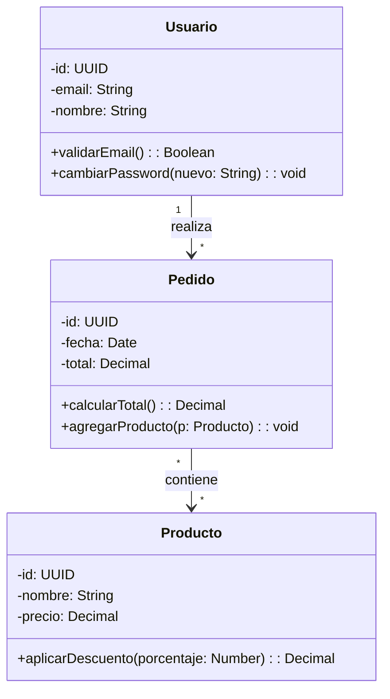

### Con Herencia e Interfaces

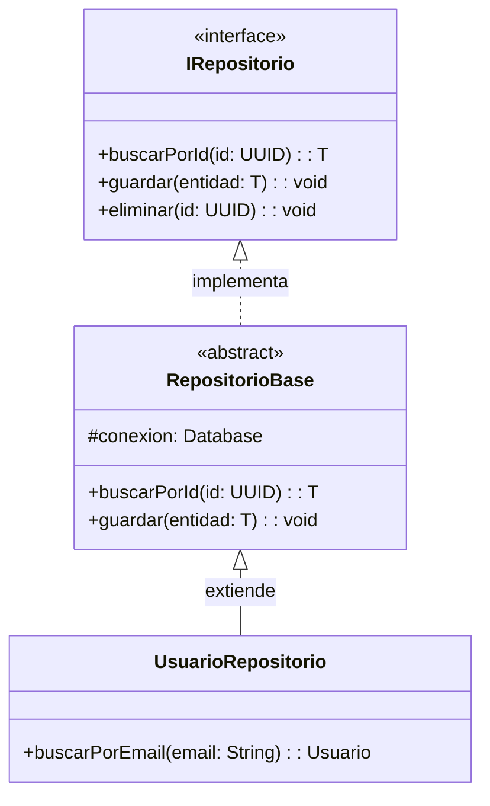

### Tipos de Relaciones

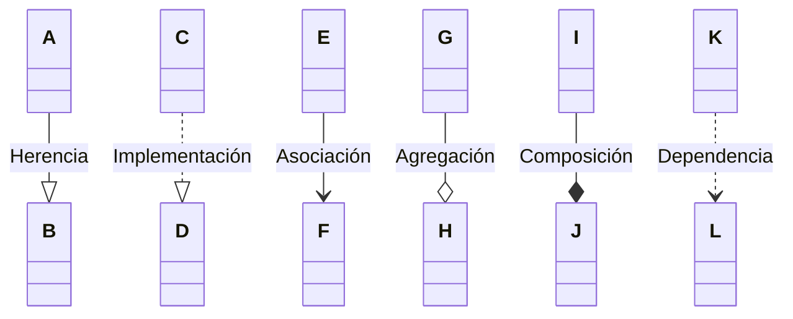

---

## Diagrama de Secuencia

### Flujo con Alternativas

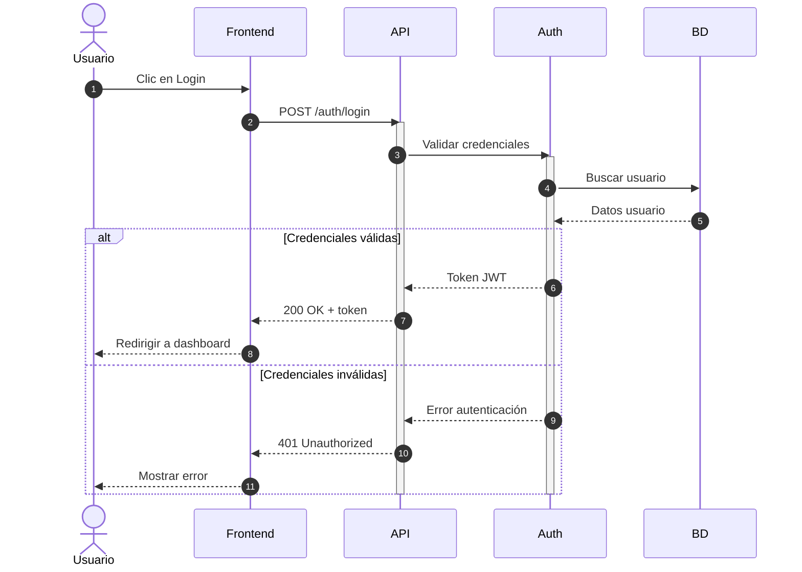

### Flujo con Loops y Notas

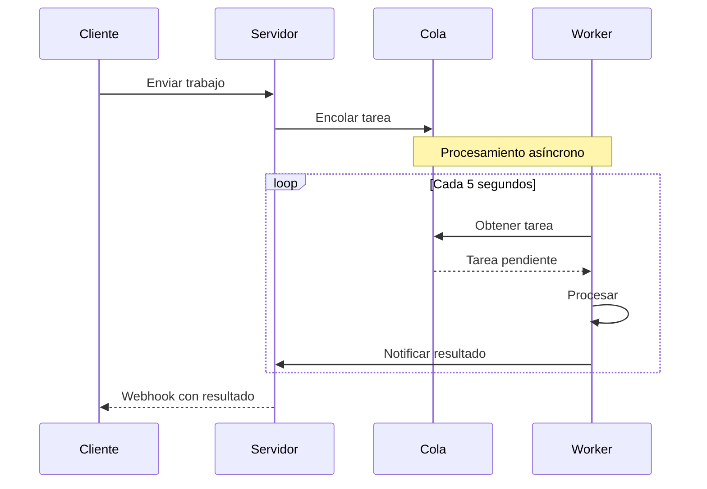

### Mensajes Paralelos

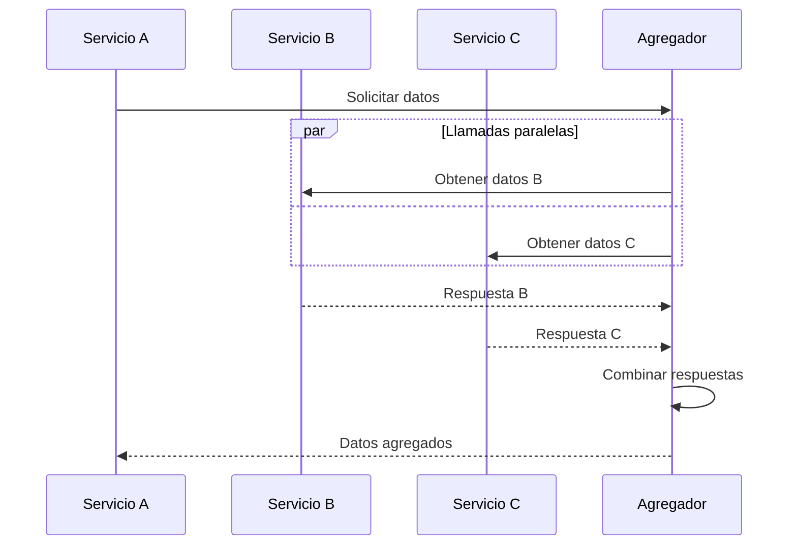

---

## Diagrama de Componentes

### Arquitectura de Capas

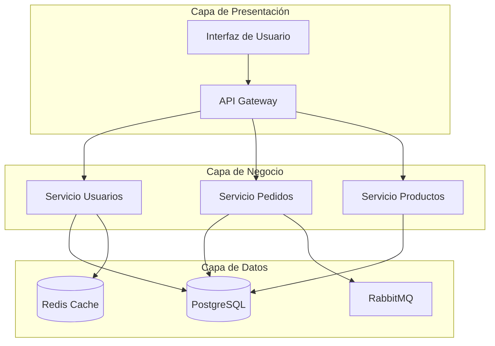

### Microservicios

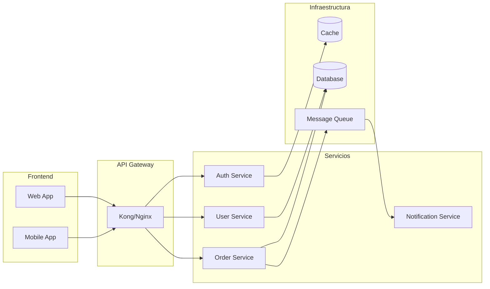

---

## Diagrama de Flujo

### Proceso con Decisiones

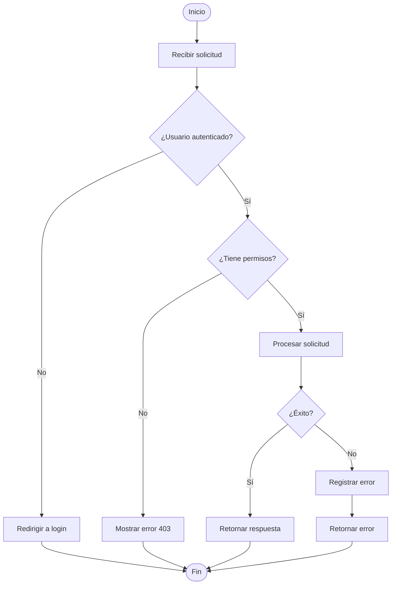

### Subgrafos para Módulos

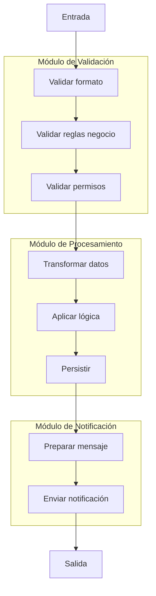

---

## Diagrama Entidad-Relación

### Modelo Completo

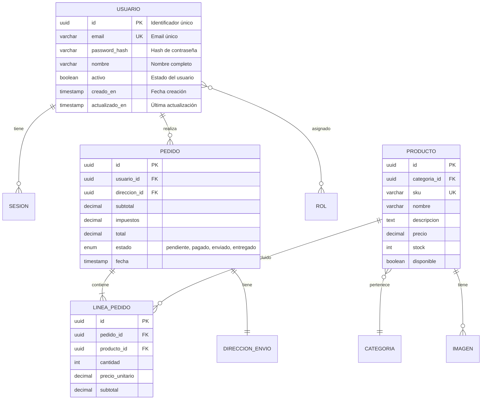

### Relaciones Especiales

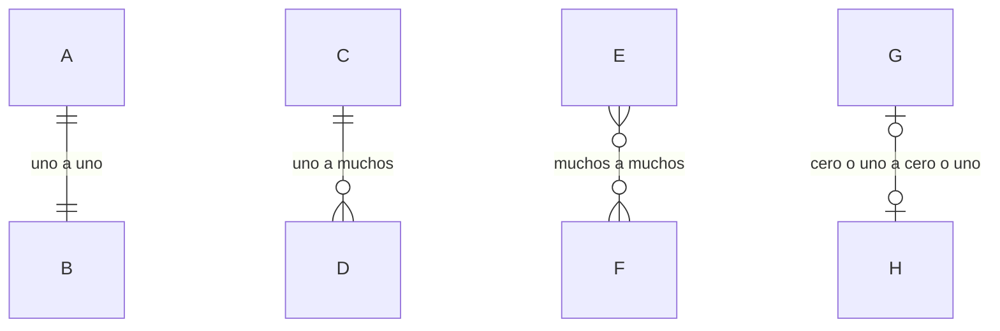

---

## Diagrama de Estados

### Máquina de Estados

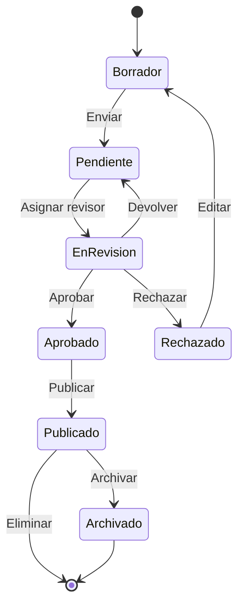

### Con Acciones

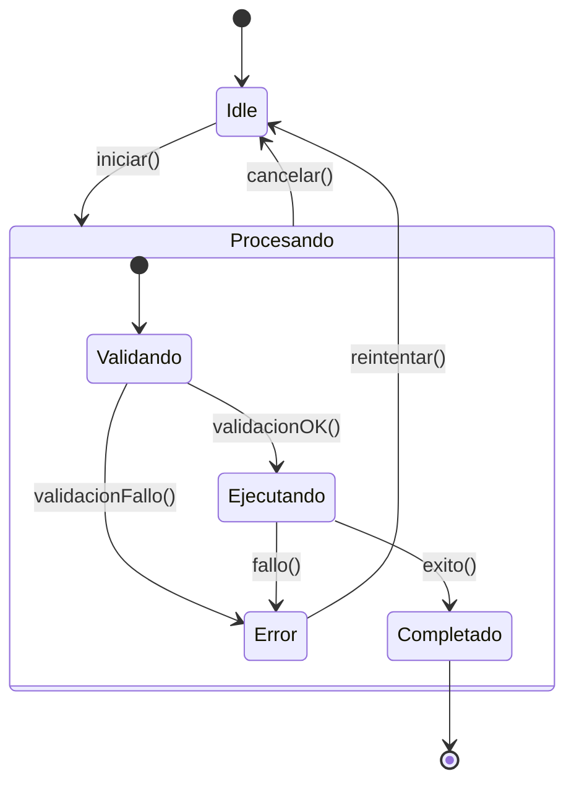

---

## Diagrama de Journey

### Experiencia de Usuario

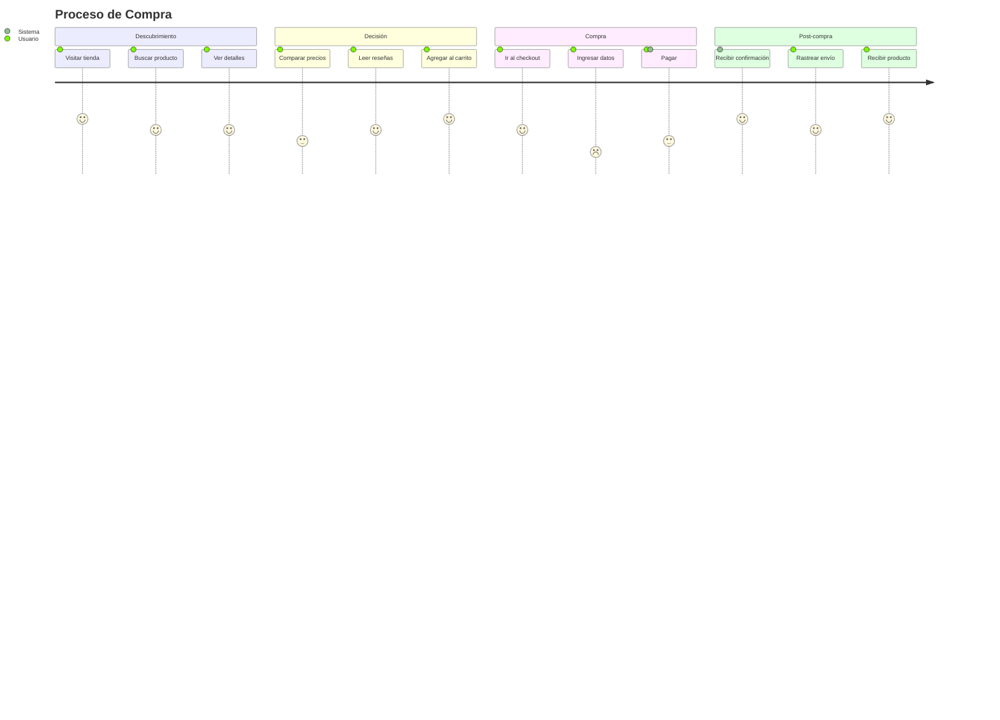

---

## Diagrama C4

### Contexto

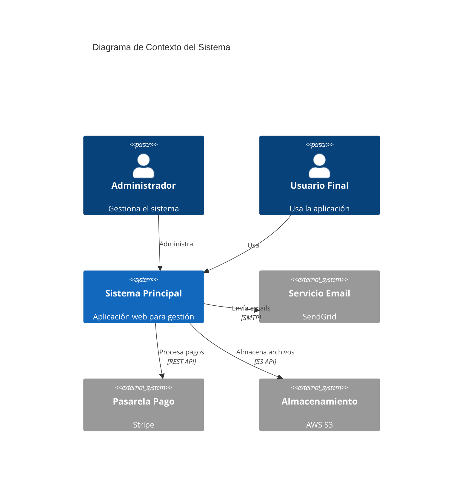

---

## Consejos de Uso

### Cuándo Usar Cada Diagrama

| Diagrama | Usar Para |
|----------|-----------|
| Clases | Estructura de código, modelos de dominio |
| Secuencia | Flujos de comunicación, APIs |
| Componentes | Arquitectura de alto nivel, módulos |
| Flujo | Procesos, algoritmos, decisiones |
| ER | Modelo de base de datos |
| Estados | Ciclos de vida de entidades |
| Journey | UX, procesos de negocio |
| C4 | Documentación arquitectónica formal |

### Buenas Prácticas

1. **Simplicidad**: Máximo 10-15 elementos por diagrama
2. **Consistencia**: Usar mismos nombres que en código
3. **Contexto**: Incluir leyenda si hay convenciones especiales
4. **Legibilidad**: Usar colores y agrupaciones con moderación
