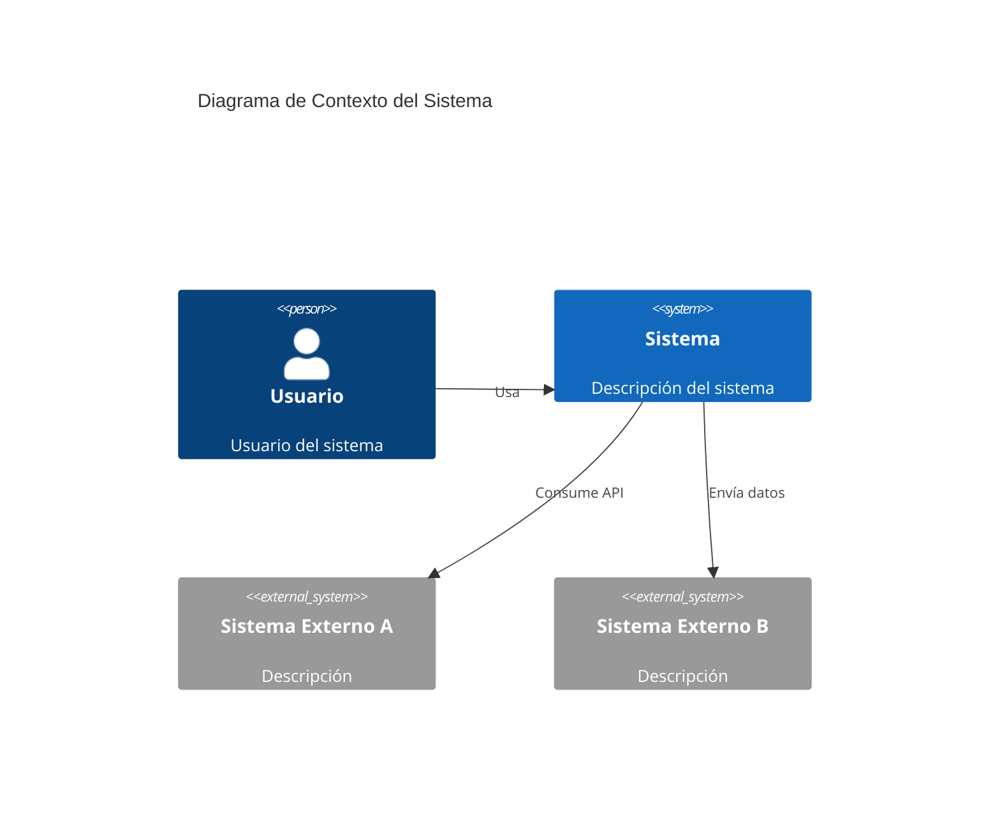
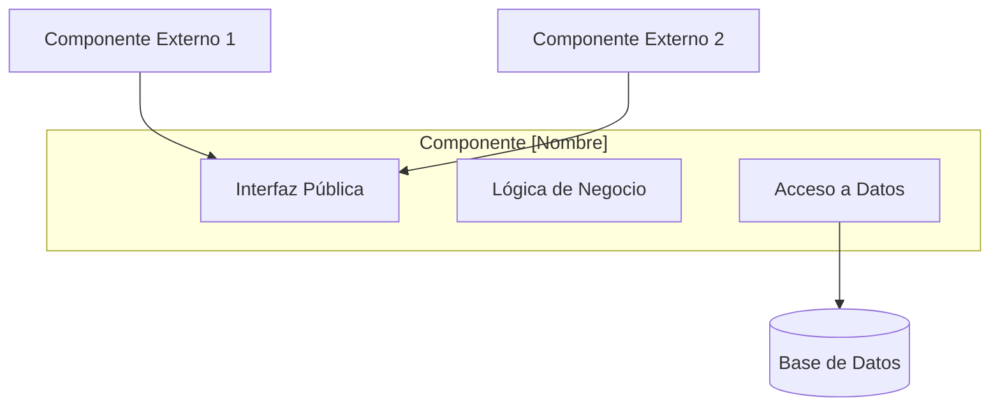
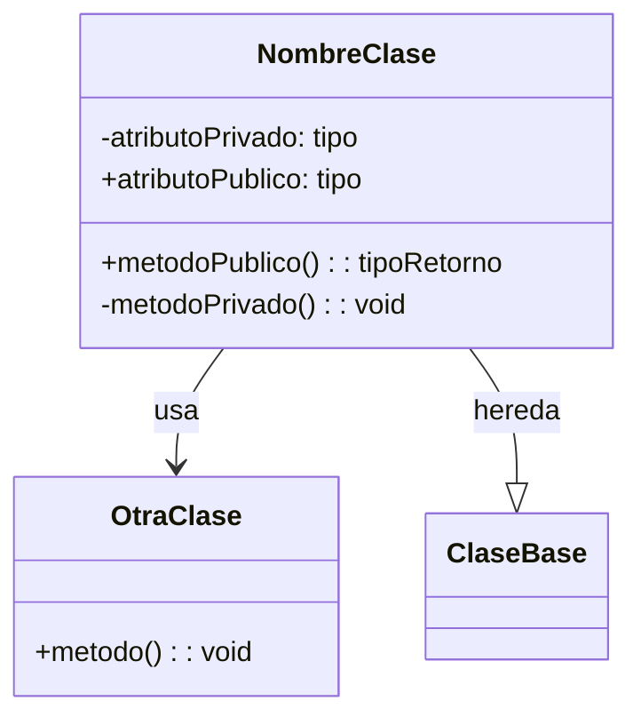
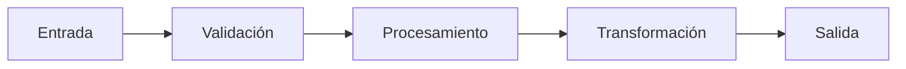
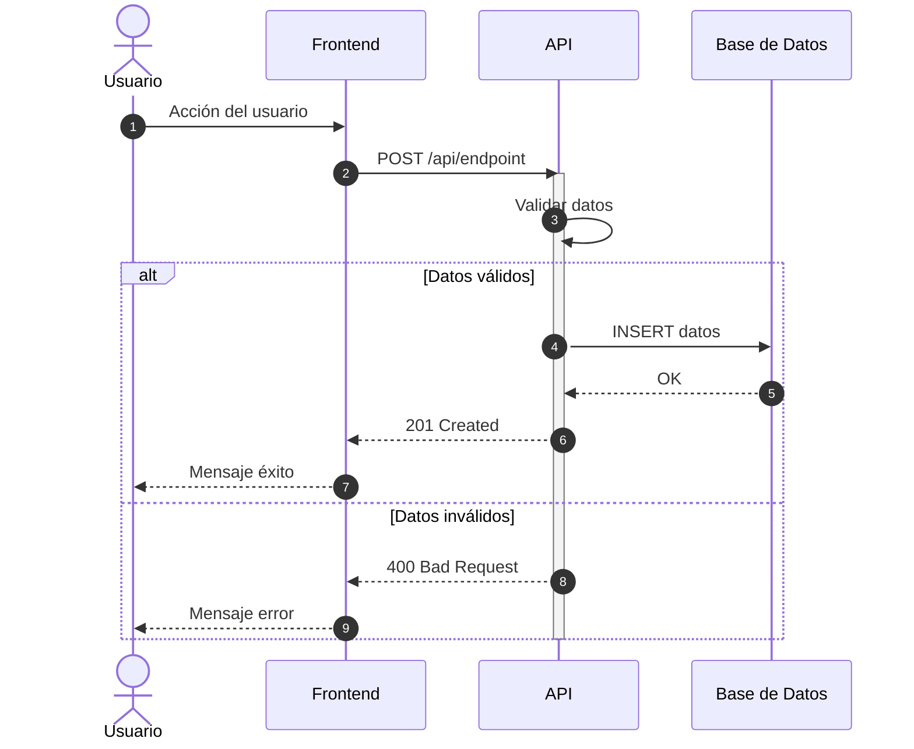
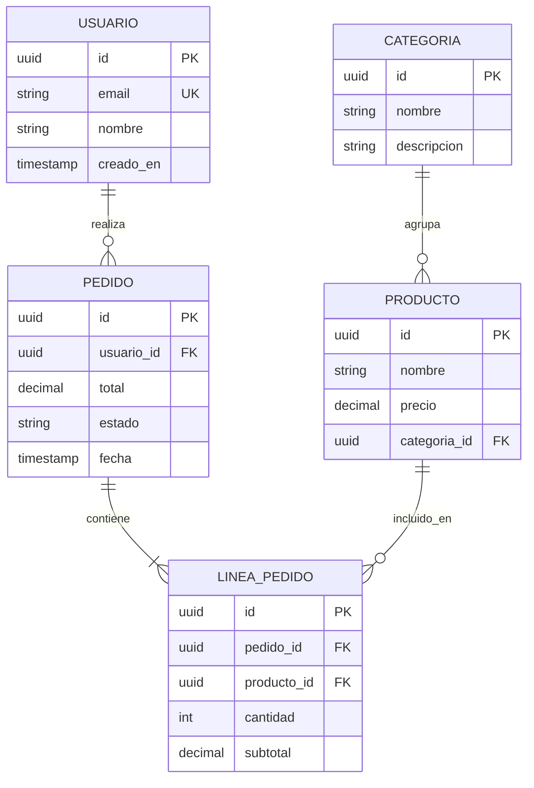

# Plantilla de Documentación de Arquitectura

## Estructura del Documento Principal (overview.md)

```markdown
# [Nombre del Proyecto] - Documentación de Arquitectura

## Visión General

### Propósito
[Descripción del propósito del sistema]

### Alcance
[Límites del sistema - qué incluye y qué no]

### Contexto del Sistema



## Stack Tecnológico

| Capa | Tecnología | Versión | Propósito |
|------|------------|---------|-----------|
| Frontend | React | 18.x | UI/UX |
| Backend | Node.js | 20.x | API REST |
| Base de Datos | PostgreSQL | 15.x | Persistencia |
| Cache | Redis | 7.x | Caché de sesiones |

## Principios de Arquitectura

1. **[Principio 1]**: [Descripción]
2. **[Principio 2]**: [Descripción]
3. **[Principio 3]**: [Descripción]

## Índice de Documentación

- [Componentes](components/)
- [Diagramas](diagrams/)
- [Decisiones de Arquitectura (ADR)](decisions/)
```

---

## Plantilla de Componente (comp-[nombre].md)

```markdown
# Componente: [Nombre del Componente]

## Información General

| Atributo | Valor |
|----------|-------|
| **Tipo** | Servicio / Módulo / Librería |
| **Responsabilidad** | [Descripción breve] |
| **Ubicación** | `src/[path]` |
| **Dependencias** | [Lista de dependencias] |

## Descripción
[Descripción detallada del componente y su rol en el sistema]

## Diagrama de Componente



## Interfaces

### Entrada

```typescript
interface InputDTO {
  campo1: string;
  campo2: number;
  // ...
}
```

### Salida

```typescript
interface OutputDTO {
  resultado: string;
  metadata: {
    timestamp: Date;
    // ...
  };
}
```

## Diagrama de Clases



## Flujo de Datos



## Configuración

| Variable | Tipo | Default | Descripción |
|----------|------|---------|-------------|
| `CONFIG_VAR_1` | string | "default" | [descripción] |
| `CONFIG_VAR_2` | number | 100 | [descripción] |

## Manejo de Errores

| Código | Nombre | Descripción | Acción |
|--------|--------|-------------|--------|
| E001 | ValidationError | Datos de entrada inválidos | Retornar 400 |
| E002 | NotFoundError | Recurso no encontrado | Retornar 404 |

## Dependencias

### Internas
- `[componente-interno]` - [propósito]

### Externas
- `[librería]` - [propósito]

## Testing

**Ubicación tests**: `tests/[path]`

**Cobertura mínima**: 80%

**Tipos de test**:
- [ ] Unitarios
- [ ] Integración
- [ ] E2E

## Consideraciones de Rendimiento

- [Consideración 1]
- [Consideración 2]

## Seguridad

- [Medida de seguridad 1]
- [Medida de seguridad 2]
```

---

## Plantilla de Diagrama de Secuencia (seq-[nombre].md)

```markdown
# Secuencia: [Nombre del Flujo]

## Descripción
[Descripción del flujo que se documenta]

## Participantes

| Participante | Tipo | Descripción |
|--------------|------|-------------|
| Usuario | Actor | Inicia el flujo |
| Frontend | Sistema | Interfaz de usuario |
| API | Sistema | Backend REST |
| DB | Sistema | Base de datos |

## Diagrama de Secuencia



## Notas del Flujo

1. **Paso 1**: [Explicación detallada]
2. **Paso 2**: [Explicación detallada]
3. **Paso 3**: [Explicación detallada]

## Manejo de Errores

| Paso | Error Posible | Manejo |
|------|---------------|--------|
| 3 | Timeout de BD | Reintentar 3 veces |
| 4 | Validación fallida | Retornar error específico |

## Latencia Esperada

| Operación | Tiempo Esperado |
|-----------|-----------------|
| Total del flujo | < 500ms |
| Llamada a BD | < 100ms |
```

---

## Plantilla de ADR (adr-[número]-[titulo].md)

```markdown
# ADR [Número]: [Título de la Decisión]

**Estado**: Propuesto | Aceptado | Deprecado | Supersedido
**Fecha**: YYYY-MM-DD
**Autores**: [Nombres]

## Contexto

[Descripción del problema o situación que requiere una decisión arquitectónica]

## Decisión

[Descripción clara de la decisión tomada]

## Alternativas Consideradas

### Alternativa 1: [Nombre]

**Descripción**: [Breve descripción]

**Pros**:
- Pro 1
- Pro 2

**Contras**:
- Contra 1
- Contra 2

### Alternativa 2: [Nombre]

**Descripción**: [Breve descripción]

**Pros**:
- Pro 1
- Pro 2

**Contras**:
- Contra 1
- Contra 2

## Justificación

[Por qué se eligió esta alternativa sobre las otras]

## Consecuencias

### Positivas
- [Consecuencia positiva 1]
- [Consecuencia positiva 2]

### Negativas
- [Consecuencia negativa 1]
- [Consecuencia negativa 2]

### Riesgos
- [Riesgo identificado y mitigación]

## Referencias

- [Link a documentación relevante]
- [Link a discusión/issue]
```

---

## Plantilla de Modelo de Datos (data-model.md)

```markdown
# Modelo de Datos

## Diagrama Entidad-Relación



## Descripción de Entidades

### USUARIO
| Campo | Tipo | Nullable | Descripción |
|-------|------|----------|-------------|
| id | UUID | No | Identificador único |
| email | VARCHAR(255) | No | Email único del usuario |
| nombre | VARCHAR(100) | No | Nombre completo |
| creado_en | TIMESTAMP | No | Fecha de creación |

[Repetir para cada entidad]

## Índices

| Tabla | Índice | Columnas | Tipo |
|-------|--------|----------|------|
| USUARIO | idx_usuario_email | email | UNIQUE |
| PEDIDO | idx_pedido_usuario | usuario_id | BTREE |

## Migraciones

| Versión | Fecha | Descripción |
|---------|-------|-------------|
| V001 | YYYY-MM-DD | Creación inicial |
| V002 | YYYY-MM-DD | Agregar campo X |
```

---

## Guía de Uso

### Para Ingeniería Inversa

1. **Analizar estructura del proyecto**:
   - Identificar capas (presentación, negocio, datos)
   - Mapear dependencias entre módulos
   - Detectar patrones arquitectónicos

2. **Extraer componentes** desde:
   - Carpetas/módulos del código
   - Clases principales
   - Servicios y controladores

3. **Documentar flujos** analizando:
   - Endpoints y rutas
   - Handlers de eventos
   - Llamadas entre servicios

4. **Reconstruir modelo de datos** desde:
   - Migraciones de BD
   - Modelos/entidades del ORM
   - Schemas de validación

### Para Nuevas Funcionalidades

1. Crear ADR antes de implementar
2. Diseñar componentes con sus interfaces
3. Documentar secuencias de los flujos principales
4. Actualizar modelo de datos si aplica
