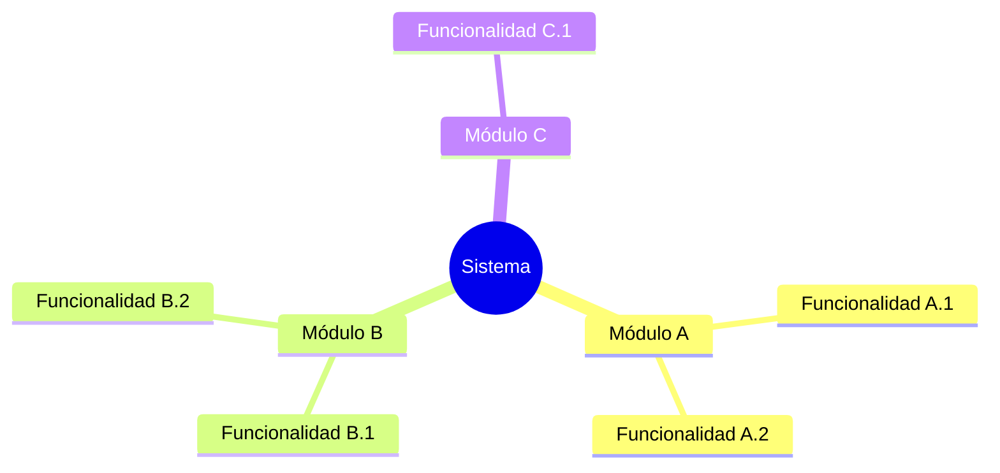
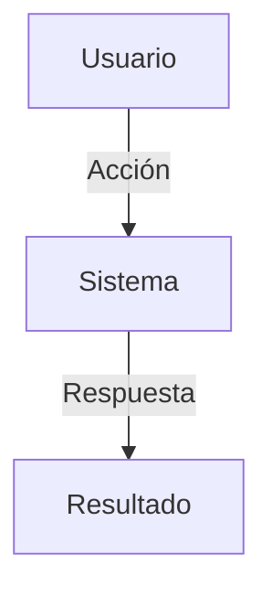
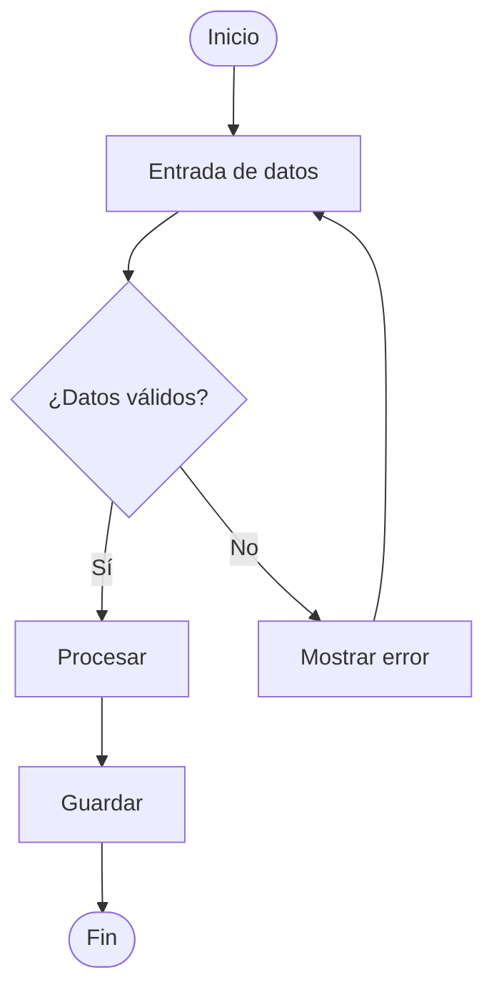
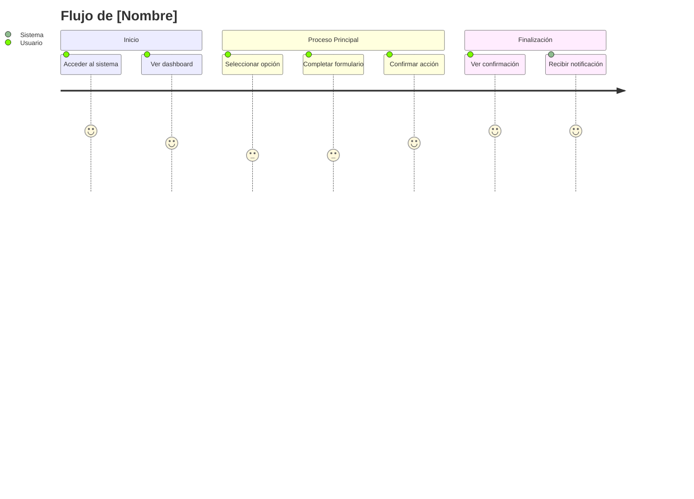
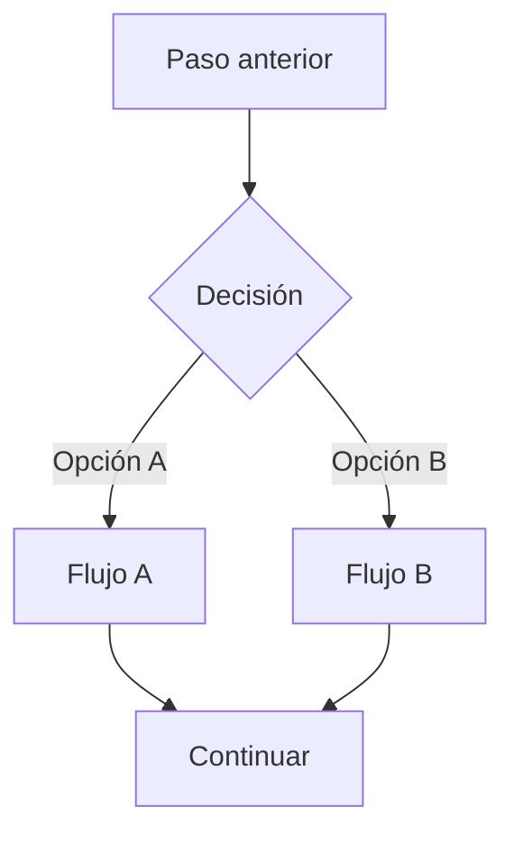

# Plantilla de Documentación Funcional

## Estructura del Documento Principal (overview.md)

```markdown
# [Nombre del Proyecto] - Documentación Funcional

## Descripción General
[Breve descripción del proyecto y su propósito principal]

## Objetivos del Sistema
- Objetivo 1
- Objetivo 2
- Objetivo 3

## Usuarios y Roles

| Rol | Descripción | Permisos |
|-----|-------------|----------|
| Administrador | [descripción] | [permisos] |
| Usuario | [descripción] | [permisos] |

## Mapa de Funcionalidades



## Índice de Funcionalidades

| ID | Funcionalidad | Módulo | Estado | Documentación |
|----|---------------|--------|--------|---------------|
| F001 | [nombre] | [módulo] | Activo | [link] |
| F002 | [nombre] | [módulo] | Activo | [link] |
```

---

## Plantilla de Funcionalidad Individual (feat-[nombre].md)

```markdown
# [Nombre de la Funcionalidad]

**ID**: F001
**Módulo**: [Nombre del módulo]
**Estado**: Activo | En desarrollo | Deprecado

## Resumen
[Descripción en 2-3 líneas de qué hace esta funcionalidad]

## Casos de Uso

### Caso de Uso Principal



**Actor**: [Tipo de usuario]
**Precondiciones**:
- Condición 1
- Condición 2

**Flujo Principal**:
1. El usuario [acción]
2. El sistema [respuesta]
3. El usuario [acción]
4. El sistema [resultado]

**Postcondiciones**:
- Estado final 1
- Estado final 2

### Flujos Alternativos

**FA1 - [Nombre del flujo alternativo]**
1. En el paso X, si [condición]
2. El sistema [acción alternativa]
3. Continúa en paso Y

### Flujos de Excepción

**FE1 - [Nombre de la excepción]**
1. Si [error/condición excepcional]
2. El sistema muestra [mensaje de error]
3. El usuario [acción correctiva]

## Diagrama de Flujo Detallado



## Reglas de Negocio

| ID | Regla | Descripción |
|----|-------|-------------|
| RN001 | [Nombre] | [Descripción de la regla] |
| RN002 | [Nombre] | [Descripción de la regla] |

## Validaciones

| Campo | Tipo | Obligatorio | Validación |
|-------|------|-------------|------------|
| email | string | Sí | Formato email válido |
| edad | number | No | Mayor a 0, menor a 150 |

## Interfaz de Usuario

### Pantalla Principal
[Descripción de la pantalla o referencia a mockup]

### Campos del Formulario
| Campo | Etiqueta | Tipo | Placeholder |
|-------|----------|------|-------------|
| name | Nombre | text | "Ingrese su nombre" |
| email | Correo | email | "ejemplo@dominio.com" |

## Mensajes del Sistema

| Código | Tipo | Mensaje |
|--------|------|---------|
| MSG001 | Éxito | "Operación completada correctamente" |
| ERR001 | Error | "El campo X es obligatorio" |

## Dependencias

**Funcionalidades relacionadas**:
- [F002 - Nombre funcionalidad](feat-funcionalidad.md)

**Servicios externos**:
- [Nombre del servicio] - [propósito]

## Historial de Cambios

| Versión | Fecha | Autor | Cambios |
|---------|-------|-------|---------|
| 1.0 | YYYY-MM-DD | [Nombre] | Versión inicial |
```

---

## Plantilla de Flujo de Usuario (user-flow-[nombre].md)

```markdown
# Flujo de Usuario: [Nombre del Flujo]

## Descripción
[Descripción del journey completo del usuario]

## Diagrama del Flujo



## Pasos Detallados

### 1. [Nombre del Paso]
- **Pantalla**: [Nombre de pantalla]
- **Acción del usuario**: [Descripción]
- **Respuesta del sistema**: [Descripción]
- **Siguiente paso**: [Link al paso 2]

### 2. [Nombre del Paso]
[Repetir estructura]

## Puntos de Decisión



## Métricas del Flujo

| Métrica | Valor Esperado |
|---------|----------------|
| Tiempo promedio | X minutos |
| Pasos totales | N pasos |
| Tasa de abandono esperada | X% |

## Puntos de Mejora Identificados
- [Punto de mejora 1]
- [Punto de mejora 2]
```

---

## Guía de Uso

### Para Ingeniería Inversa

1. **Identificar funcionalidades** analizando:
   - Rutas/endpoints del código
   - Componentes de UI
   - Handlers de eventos
   - Servicios y métodos públicos

2. **Extraer casos de uso** desde:
   - Tests existentes
   - Comentarios en código
   - Nombres de funciones y métodos
   - Flujos de la UI

3. **Documentar reglas de negocio** encontradas en:
   - Validaciones
   - Condiciones en if/switch
   - Constantes y configuraciones
   - Mensajes de error

### Para Nuevas Funcionalidades

1. **Partir de requisitos** para crear casos de uso
2. **Definir flujos** antes de implementar
3. **Documentar validaciones** y reglas de negocio
4. **Actualizar índice** de funcionalidades
