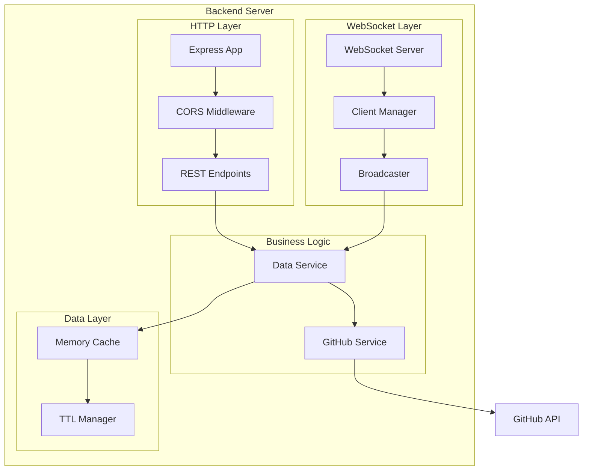
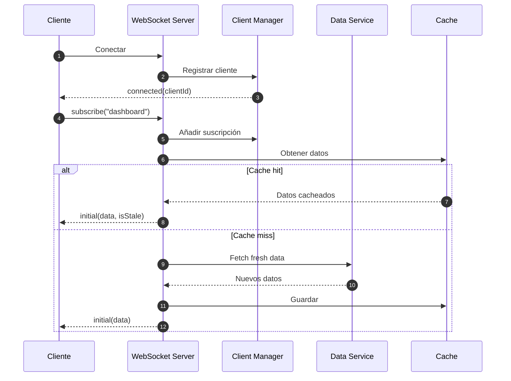
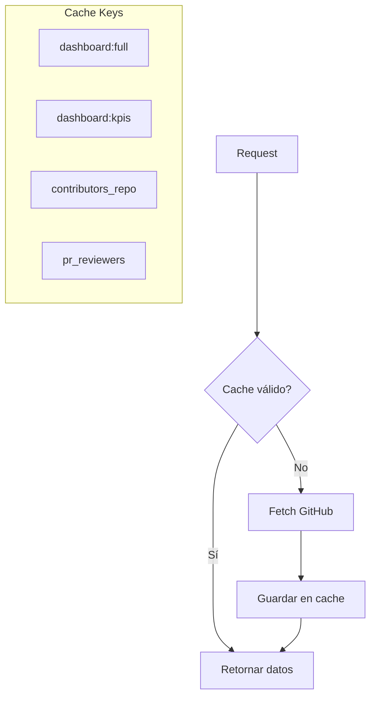

# Componente: Backend WebSocket Server

## Información General

| Atributo | Valor |
|----------|-------|
| **Tipo** | Servidor Node.js |
| **Responsabilidad** | API REST, WebSocket, Caché, GitHub Integration |
| **Ubicación** | `server/src/` |
| **Tecnologías** | Node.js, Express, ws, Axios |

## Descripción

El backend es un servidor Node.js que actúa como intermediario entre el frontend y la API de GitHub Enterprise. Proporciona comunicación en tiempo real via WebSocket, caché en memoria para optimizar llamadas a la API, y endpoints REST como fallback.

## Diagrama de Componentes



## Endpoints REST

| Endpoint | Método | Descripción |
|----------|--------|-------------|
| `/api/health` | GET | Health check y estadísticas |
| `/api/dashboard` | GET | Datos completos del dashboard |
| `/api/kpis` | GET | Solo KPIs para carga rápida |
| `/api/contributors/:repo` | GET | Contribuidores de un repositorio |
| `/api/reviewers` | GET | Ranking de revisores de PRs |

## Mensajes WebSocket

### Cliente → Servidor

```typescript
// Suscribirse a un canal
{ "type": "subscribe", "channel": "dashboard" }

// Solicitar actualización manual
{ "type": "refresh" }

// Keep-alive
{ "type": "ping" }
```

### Servidor → Cliente

```typescript
// Conexión establecida
{ "type": "connected", "clientId": "..." }

// Datos iniciales/actualizados
{ 
  "type": "initial" | "update", 
  "phase": "kpis" | "complete", 
  "data": {...} 
}

// Actualización en progreso
{ "type": "refreshing" }

// Rate limited
{ "type": "rate_limit", "retryAfter": 10 }

// Error
{ "type": "error", "message": "...", "code": "..." }
```

## Flujo de Conexión WebSocket



## Configuración

| Variable | Tipo | Default | Descripción |
|----------|------|---------|-------------|
| `PORT` | number | 3001 | Puerto del servidor |
| `GITHUB_TOKEN` | string | - | Token de GitHub Enterprise |
| `GITHUB_API_URL` | string | bbva.ghe.com/api/v3 | URL de la API |
| `GITHUB_ORG` | string | copilot-full-capacity | Organización |
| `FRONTEND_URL` | string | localhost:3000 | Origen CORS permitido |
| `CACHE_TTL` | number | 30 | TTL de caché en segundos |

## Manejo de Errores

| Código | Nombre | Descripción | Acción |
|--------|--------|-------------|--------|
| FETCH_ERROR | Error de fetch | Fallo al obtener datos de GitHub | Broadcast error a clientes |
| RATE_LIMIT | Rate limited | Demasiadas solicitudes | Retornar tiempo de espera |
| AUTH_ERROR | Autenticación | Token inválido | Log y error a cliente |
| CONN_ERROR | Conexión | Error de conexión WS | Cleanup y reconexión |

## Sistema de Caché



## Broadcast a Clientes

```typescript
function broadcast(channel: string, message: WSMessage): void {
  clients.forEach((info, ws) => {
    if (ws.readyState === WebSocket.OPEN && 
        info.subscriptions.has(channel)) {
      ws.send(JSON.stringify(message));
    }
  });
}
```

## Rate Limiting

- **Límite**: 1 refresh manual cada 10 segundos por cliente
- **Implementación**: Timestamp de último refresh por clientId
- **Respuesta**: `rate_limit` con `retryAfter` en segundos

## Dependencias

### Internas
- `cache.ts` - Sistema de caché en memoria
- `githubService.ts` - Cliente de GitHub API
- `types.ts` - Definiciones TypeScript

### Externas
| Librería | Propósito |
|----------|-----------|
| `express` | HTTP server |
| `ws` | WebSocket server |
| `cors` | CORS middleware |
| `axios` | Cliente HTTP para GitHub |
| `dotenv` | Variables de entorno |
| `tsx` | TypeScript execution en desarrollo |
