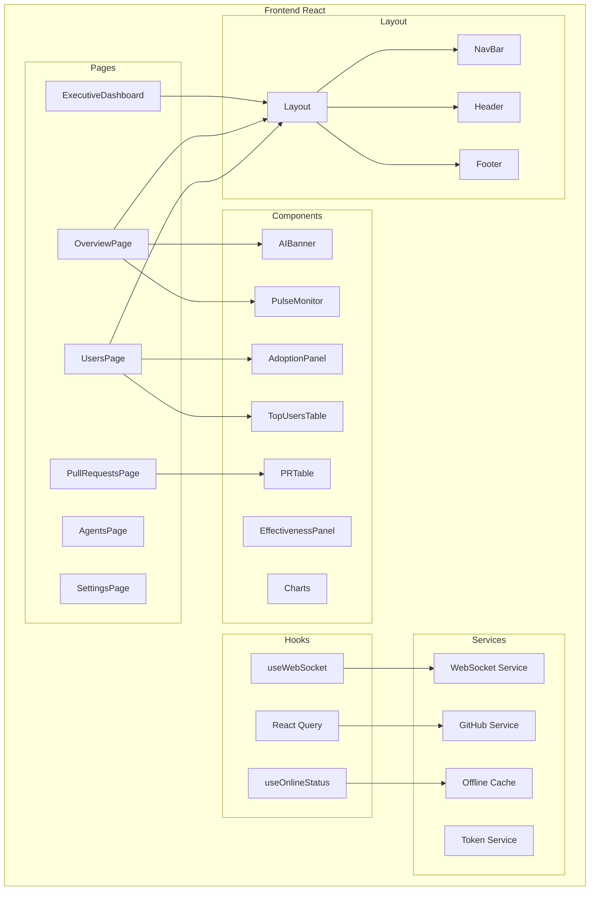
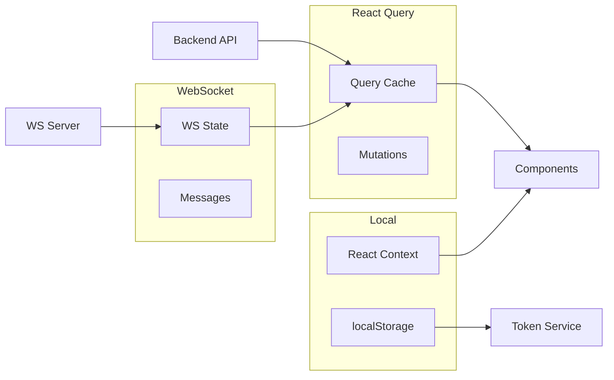

# Componente: Frontend React

## Información General

| Atributo | Valor |
|----------|-------|
| **Tipo** | Aplicación Web SPA |
| **Responsabilidad** | UI, navegación, gestión de estado cliente |
| **Ubicación** | `src/` |
| **Tecnologías** | React 19, TypeScript, TailwindCSS, React Query |

## Descripción

El frontend es una Single Page Application (SPA) construida con React que proporciona la interfaz de usuario del portal de métricas. Implementa un diseño moderno con componentes reutilizables, animaciones fluidas, y soporte PWA para funcionamiento offline.

## Diagrama de Componentes



## Estructura de Páginas

### Executive Dashboard (`/dashboard`)
Vista ejecutiva con KPIs principales y gráficos de tendencias.

### Overview (`/`)
Página principal con banner AI, monitores de pulso, y gráfico de contribuciones.

### Usuarios (`/users`)
Métricas de adopción, distribución por editor, rankings de usuarios y contribuidores.

### Pull Requests (`/prs`)
Tabla de PRs con filtros, estadísticas de merge/rejection, y tiempos.

### Agentes (`/agents`)
Analytics de Custom Agents: distribución, efectividad, radar de métricas.

### Settings (`/settings`)
Configuración de token GitHub y preferencias de usuario.

## Componentes Principales

### AIBanner
Banner hero con métricas principales de Copilot y efectos visuales (partículas, confetti).

```typescript
interface AIBannerProps {
  totalPRs: number;
  withAgent: number;
  mergeRate: number;
  uniqueAgents: number;
  merged?: number;
  avgDaysToClose?: number | string;
  open?: number;
}
```

### AdoptionPanel
Panel de métricas de adopción con barras de progreso y estadísticas.

### EffectivenessPanel
Dashboard de efectividad con Merge Rate, Rejection Rate, y Pending Rate.

### TopUsersTable
Tabla paginada de usuarios con ranking por PRs asignadas.

### PulseMonitor
Visualización en tiempo real de actividad con gráfico animado tipo ECG.

## Gestión de Estado



## Routing

```typescript
const routes = [
  { path: '/', element: <OverviewPage /> },
  { path: '/dashboard', element: <ExecutiveDashboard /> },
  { path: '/users', element: <UsersPage /> },
  { path: '/prs', element: <PullRequestsPage /> },
  { path: '/agents', element: <AgentsPage /> },
  { path: '/settings', element: <SettingsPage /> },
];
```

## Estilos y Diseño

- **Framework CSS**: TailwindCSS con configuración personalizada
- **Colores BBVA**: Paleta corporativa definida en `tailwind.config.js`
- **Animaciones**: CSS animations para fade-in, pulse, y transiciones
- **Responsive**: Mobile-first con breakpoints md, lg, xl
- **Dark Mode**: Diseño oscuro por defecto (estilo "Stitch")

## PWA Features

- **Service Worker**: Caché de assets estáticos
- **Manifest**: Instalable como app nativa
- **Offline**: Funciona con datos cacheados sin conexión
- **Updates**: Auto-update en segundo plano

## Dependencias Externas

| Librería | Propósito |
|----------|-----------|
| `@tanstack/react-query` | Gestión de estado servidor y caché |
| `react-router-dom` | Navegación SPA |
| `recharts` | Gráficos y visualizaciones |
| `lucide-react` | Iconos SVG |
| `axios` | Cliente HTTP |
| `date-fns` | Manipulación de fechas |
