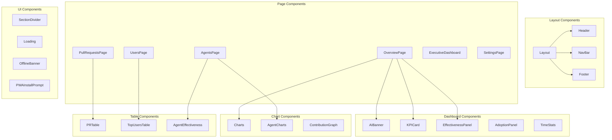
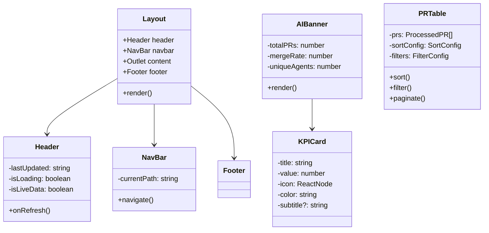
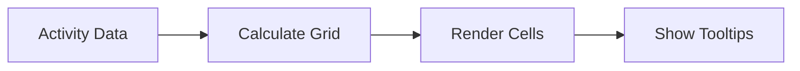

# Componentes - Visión General

## Diagrama de Componentes



## Jerarquía de Componentes



## Componentes Principales

### Layout (Contenedor Principal)

| Propiedad | Tipo | Descripción |
|-----------|------|-------------|
| children | ReactNode | Contenido de la página |

**Responsabilidades:**
- Gestiona la estructura general de la aplicación
- Incluye Header, NavBar y Footer
- Usa React Router `<Outlet>` para contenido dinámico
- Maneja el estado global de datos via `useOutletContext`

### Header

| Propiedad | Tipo | Descripción |
|-----------|------|-------------|
| lastUpdated | string | Timestamp de última actualización |
| onRefresh | () => void | Callback para refrescar datos |
| isLoading | boolean | Estado de carga |
| isLiveData | boolean | Indica si los datos son en vivo |
| dataSource | string | Origen de los datos |

### KPICard

| Propiedad | Tipo | Descripción |
|-----------|------|-------------|
| title | string | Título del KPI |
| value | number | Valor numérico |
| icon | ReactNode | Icono a mostrar |
| color | string | Color del tema (blue, green, etc.) |
| subtitle | string? | Texto adicional |

### AIBanner

Banner principal que muestra métricas destacadas de Copilot.

| Propiedad | Tipo |
|-----------|------|
| totalPRs | number |
| withAgent | number |
| mergeRate | number |
| uniqueAgents | number |
| merged | number |
| avgDaysToClose | number |
| open | number |
| rejectionRate | number |

## Componentes de Gráficos

### Charts.tsx

Exporta múltiples componentes de visualización:

- **TopItemsChart**: Gráfico de barras horizontal
- **DistributionPieChart**: Gráfico de pastel
- **TrendChart**: Gráfico de línea temporal
- **EditorDistribution**: Distribución de editores

### AgentCharts.tsx

Componentes específicos para análisis de agentes:

- **AgentDistributionChart**: Distribución por agente
- **AgentEffectivenessChart**: Efectividad comparativa
- **AgentUsageBarChart**: Uso por agente
- **AgentRadarChart**: Radar de métricas
- **AgentSummaryCards**: Cards resumen

### ContributionGraph

Grafo de contribuciones estilo GitHub.



## Componentes de Tablas

### PRTable

Tabla paginada y filtrable de Pull Requests.

**Características:**
- Ordenación por múltiples columnas
- Filtrado por estado, repositorio, agente
- Paginación
- Exportación (futuro)

### TopUsersTable

Tabla de usuarios con más actividad.

### AgentEffectiveness

Tabla comparativa de efectividad de agentes.

## Patrones de Diseño

### 1. Compound Components

Algunos componentes usan el patrón de componentes compuestos:

```typescript
<SectionDivider variant="tech" icon="sparkles" text="Adopción" />
```

### 2. Render Props

Para componentes con lógica compartida:

```typescript
<AnimatedNumber value={100} duration={1500} decimals={1} suffix="%" />
```

### 3. Presentational + Container

- **Presentational**: KPICard, Charts (solo UI)
- **Container**: Pages (conectan datos con UI)

## Índice de Componentes

| Componente | Archivo | Categoría |
|------------|---------|-----------|
| Layout | Layout.tsx | Layout |
| Header | Header.tsx | Layout |
| NavBar | NavBar.tsx | Layout |
| Footer | Footer.tsx | Layout |
| AIBanner | AIBanner.tsx | Dashboard |
| KPICard | KPICard.tsx | Dashboard |
| EffectivenessPanel | EffectivenessPanel.tsx | Dashboard |
| AdoptionPanel | AdoptionPanel.tsx | Dashboard |
| TimeStats | TimeStats.tsx | Dashboard |
| Charts | Charts.tsx | Gráficos |
| AgentCharts | AgentCharts.tsx | Gráficos |
| ContributionGraph | ContributionGraph.tsx | Gráficos |
| PRTable | PRTable.tsx | Tablas |
| TopUsersTable | TopUsersTable.tsx | Tablas |
| AgentEffectiveness | AgentEffectiveness.tsx | Tablas |
| SectionDivider | SectionDivider.tsx | UI |
| Loading | Loading.tsx | UI |
| OfflineBanner | OfflineBanner.tsx | UI |
| PWAInstallPrompt | PWAInstallPrompt.tsx | UI |
