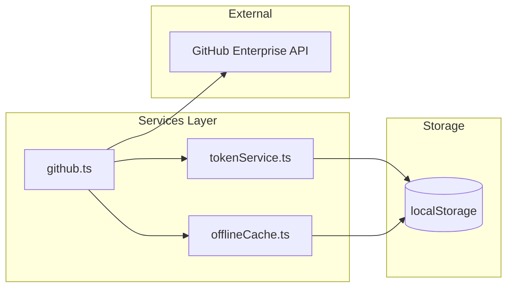
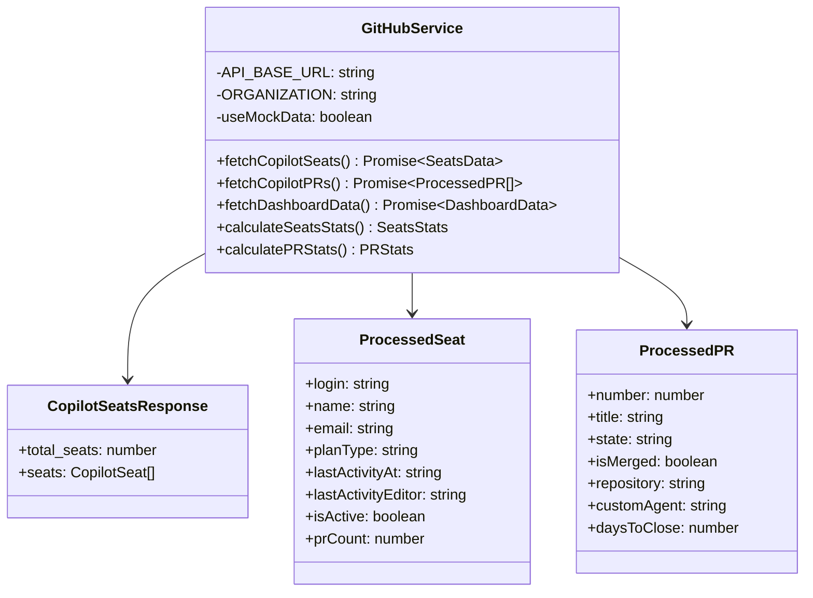
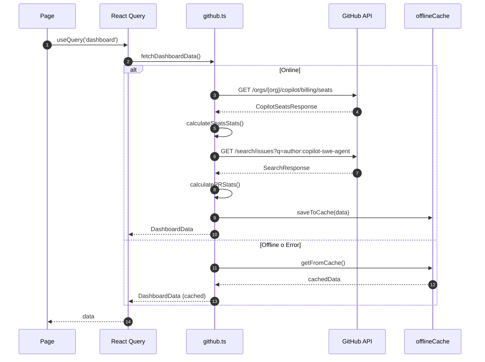
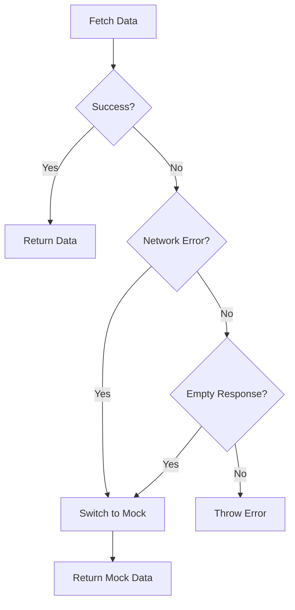
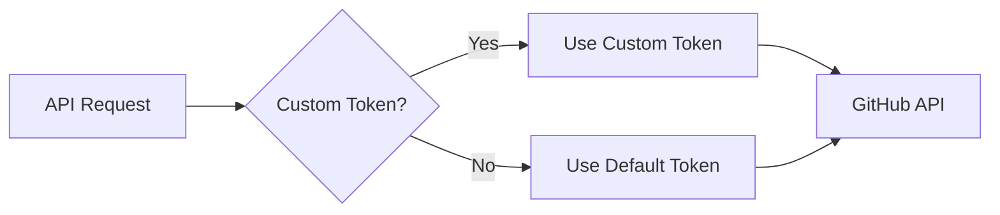
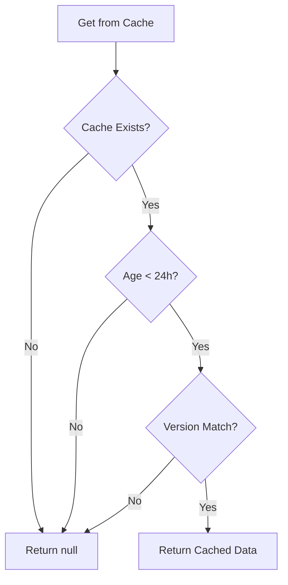
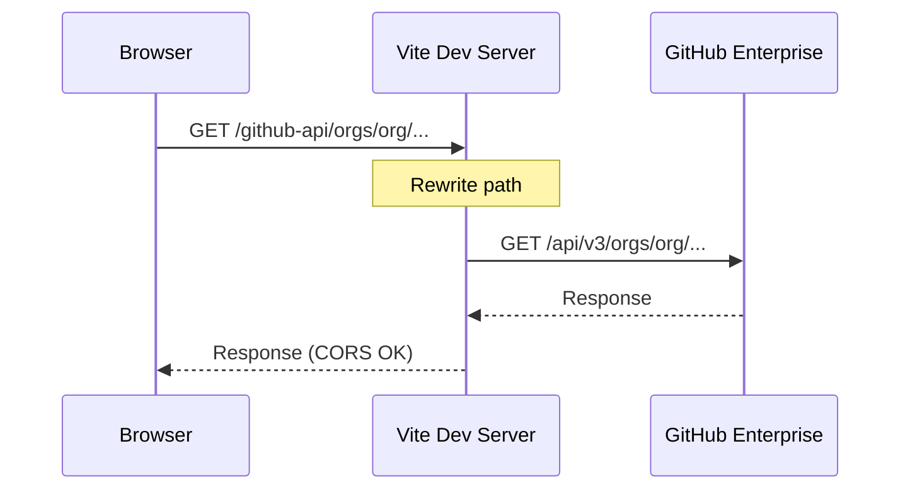

# Servicios - Capa de Datos

## Visión General

La capa de servicios gestiona toda la comunicación con APIs externas y el almacenamiento local. Está compuesta por tres módulos principales:



## github.ts - Servicio Principal

### Descripción

Servicio central que maneja todas las operaciones con la API de GitHub Enterprise. Implementa:
- Fetching de datos de Copilot Seats
- Búsqueda de Pull Requests
- Procesamiento y cálculo de estadísticas
- Fallback a datos mock cuando la API no está disponible

### Diagrama de Clases



### Flujo de Datos



### Funciones Principales

#### fetchCopilotSeats()

```typescript
async function fetchCopilotSeats(): Promise<{
  totalSeats: number;
  seats: ProcessedSeat[];
}>
```

**Proceso:**
1. Consulta paginada a `/orgs/{org}/copilot/billing/seats`
2. Procesa cada seat extrayendo información relevante
3. Calcula `agentUsageCount` basado en actividad reciente
4. Retorna lista de usuarios con licencia Copilot

#### fetchCopilotPRs()

```typescript
async function fetchCopilotPRs(): Promise<ProcessedPR[]>
```

**Proceso:**
1. Búsqueda de PRs con `author:app/copilot-swe-agent`
2. Extrae Custom Agent del body del PR
3. Calcula métricas de tiempo (daysToClose)
4. Identifica assignees

#### calculatePRStats()

Calcula estadísticas agregadas:
- Totales: open, closed, merged, rejected
- Rates: mergeRate, rejectionRate, pendingRate
- Tiempo: avgDaysToClose, min, max
- Rankings: topRepos, topAgents
- Efectividad por agente y repositorio

### Manejo de Errores



---

## tokenService.ts - Gestión de Tokens

### Descripción

Gestiona el token de autenticación para GitHub API de forma segura.

### Funciones

```typescript
// Obtener token efectivo (custom o default)
function getEffectiveToken(): string

// Establecer token personalizado
function setCustomToken(token: string): void

// Limpiar token personalizado
function clearCustomToken(): void

// Verificar si hay token custom
function hasCustomToken(): boolean
```

### Flujo de Token



---

## offlineCache.ts - Cache Offline

### Descripción

Implementa persistencia local para soporte offline usando localStorage.

### Estructura del Cache

```typescript
interface CachedData {
  data: DashboardData;
  timestamp: number;
  version: string;
}
```

### Funciones

```typescript
// Guardar datos en cache
function saveToCache(data: DashboardData): void

// Obtener datos del cache
function getFromCache(): CachedData | null

// Verificar si cache es válido
function isCacheValid(cached: CachedData): boolean

// Limpiar cache
function clearCache(): void
```

### Política de Expiración



---

## Configuración del Proxy

### vite.config.ts

```typescript
export default defineConfig({
  server: {
    proxy: {
      '/github-api': {
        target: 'https://bbva.ghe.com/api/v3',
        changeOrigin: true,
        rewrite: (path) => path.replace(/^\/github-api/, ''),
        secure: false
      }
    }
  }
})
```

### Diagrama de Proxy



---

## Tipos de Datos

### Tipos de Entrada (API)

```typescript
interface CopilotSeat {
  assignee: {
    login: string;
    name?: string;
    email?: string;
    avatar_url?: string;
  };
  plan_type: string;
  created_at: string;
  last_activity_at: string | null;
  last_activity_editor: string | null;
}

interface PullRequest {
  number: number;
  title: string;
  state: 'open' | 'closed';
  html_url: string;
  created_at: string;
  closed_at: string | null;
  body: string | null;
  comments: number;
  pull_request?: { merged_at: string | null };
}
```

### Tipos de Salida (Procesados)

```typescript
interface DashboardData {
  seats: SeatsStats | null;
  seatsList: ProcessedSeat[];
  prs: PRStats;
  prList: ProcessedPR[];
  lastUpdated: string;
  isLiveData: boolean;
  dataSource: string;
}

interface PRStats {
  total: number;
  open: number;
  merged: number;
  rejected: number;
  mergeRate: number;
  topRepos: Array<{ name: string; count: number }>;
  topAgents: Array<{ name: string; count: number }>;
  agentEffectiveness: AgentStats[];
  // ... más campos
}
```

---

## Consideraciones de Rendimiento

1. **Paginación**: Las llamadas a API usan paginación (100 items/página)
2. **Rate Limiting**: Delays de 300-500ms entre páginas
3. **Caching**: React Query con staleTime de 5 minutos
4. **Memoization**: Cálculos pesados solo cuando cambian datos

## Seguridad

1. **Tokens**: Nunca se exponen en código
2. **CORS**: Proxy evita problemas de cross-origin
3. **HTTPS**: Todas las comunicaciones cifradas
4. **Sanitización**: Datos de entrada validados
