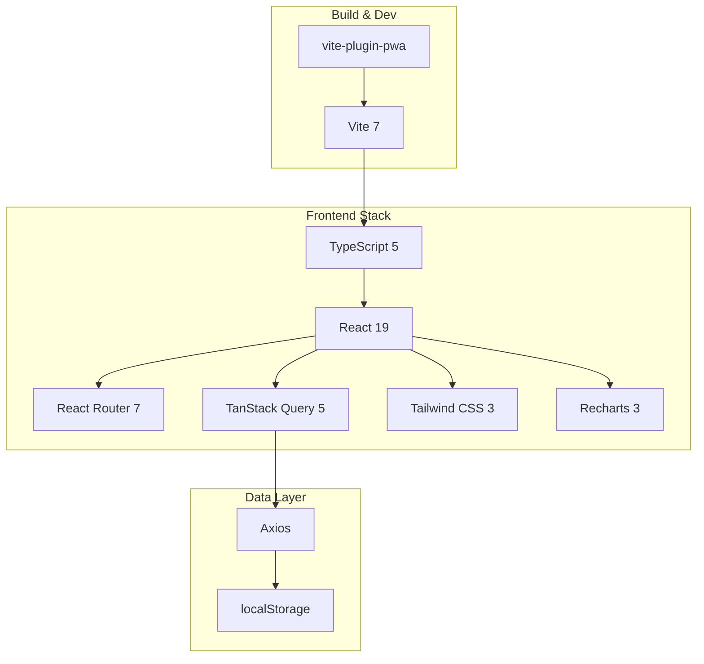

# ADR-001: Stack Tecnológico

**Estado**: Aceptado
**Fecha**: 2025-01-15
**Autores**: Equipo de Desarrollo

## Contexto

Se requiere desarrollar una aplicación web para visualizar métricas de GitHub Copilot en una organización. La aplicación debe:
- Ser accesible desde navegadores modernos
- Consumir datos de la API de GitHub Enterprise
- Mostrar dashboards interactivos con gráficos
- Funcionar offline (PWA)
- Tener un tiempo de desarrollo acotado

## Decisión

Se decide utilizar el siguiente stack tecnológico:

| Capa | Tecnología | Justificación |
|------|------------|---------------|
| **Framework** | React 19 | Ecosistema maduro, componentes declarativos |
| **Routing** | React Router DOM 7 | Estándar de facto para SPA |
| **State/Data** | TanStack Query 5 | Cache automático, manejo de estados async |
| **HTTP** | Axios | Interceptores, transformaciones |
| **Estilos** | Tailwind CSS 3 | Desarrollo rápido, bundle optimizado |
| **Gráficos** | Recharts 3 | Basado en React, fácil personalización |
| **Build** | Vite 7 | Build rápido, HMR excelente |
| **Lenguaje** | TypeScript 5 | Seguridad de tipos, mejor DX |
| **PWA** | vite-plugin-pwa | Integración simple con Vite |

### Diagrama de Stack

## Alternativas Consideradas

### Alternativa 1: Next.js

**Descripción**: Framework fullstack con React

**Pros**:
- SSR/SSG out of the box
- Routing basado en archivos
- Optimizaciones automáticas

**Contras**:
- Overhead para una SPA simple
- No necesitamos SSR (datos son privados)
- Mayor complejidad de deployment

### Alternativa 2: Vue.js + Nuxt

**Descripción**: Framework alternativo a React

**Pros**:
- Sintaxis más simple
- Mejor rendimiento en algunos casos
- Composition API potente

**Contras**:
- Menor ecosistema de librerías de gráficos
- Equipo más familiarizado con React
- Menos recursos de aprendizaje disponibles

### Alternativa 3: Angular

**Descripción**: Framework empresarial de Google

**Pros**:
- Muy estructurado
- TypeScript nativo
- CLI potente

**Contras**:
- Curva de aprendizaje alta
- Verboso para aplicaciones pequeñas
- Bundle más grande

## Justificación

Se eligió React + Vite porque:

1. **Velocidad de desarrollo**: El equipo tiene experiencia previa con React
2. **Rendimiento**: Vite ofrece HMR instantáneo y builds optimizados
3. **Flexibilidad**: React permite elegir las mejores librerías para cada necesidad
4. **Comunidad**: Amplia documentación y soporte de la comunidad
5. **PWA**: vite-plugin-pwa hace trivial agregar soporte offline

## Consecuencias

### Positivas
- Desarrollo rápido con herramientas familiares
- Excelente experiencia de desarrollo (DX)
- Bundle optimizado y rendimiento de producción
- Soporte PWA sin configuración adicional compleja

### Negativas
- Dependencia del ecosistema de React
- Necesidad de elegir librerías adicionales manualmente
- Sin SEO (no relevante para esta aplicación privada)

### Riesgos
- **Actualizaciones de dependencias**: Mitigado con dependabot y tests
- **Breaking changes en React 19**: Mitigado usando features estables

## Referencias

- [React Documentation](https://react.dev)
- [Vite Documentation](https://vitejs.dev)
- [TanStack Query](https://tanstack.com/query)
- [Tailwind CSS](https://tailwindcss.com)
- [Recharts](https://recharts.org)
