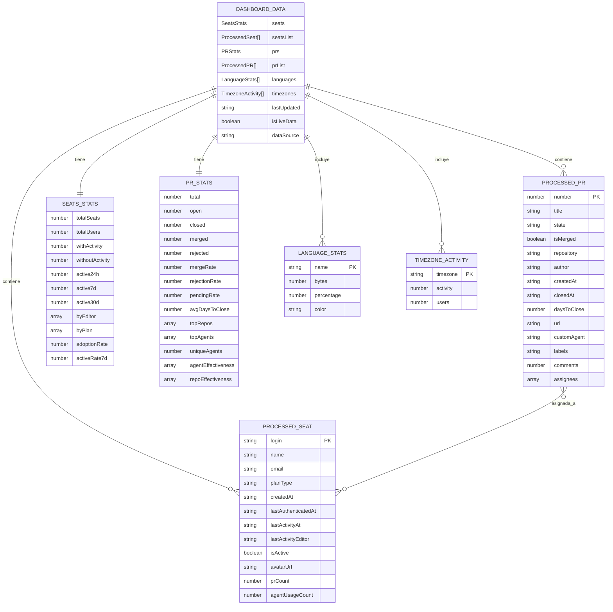
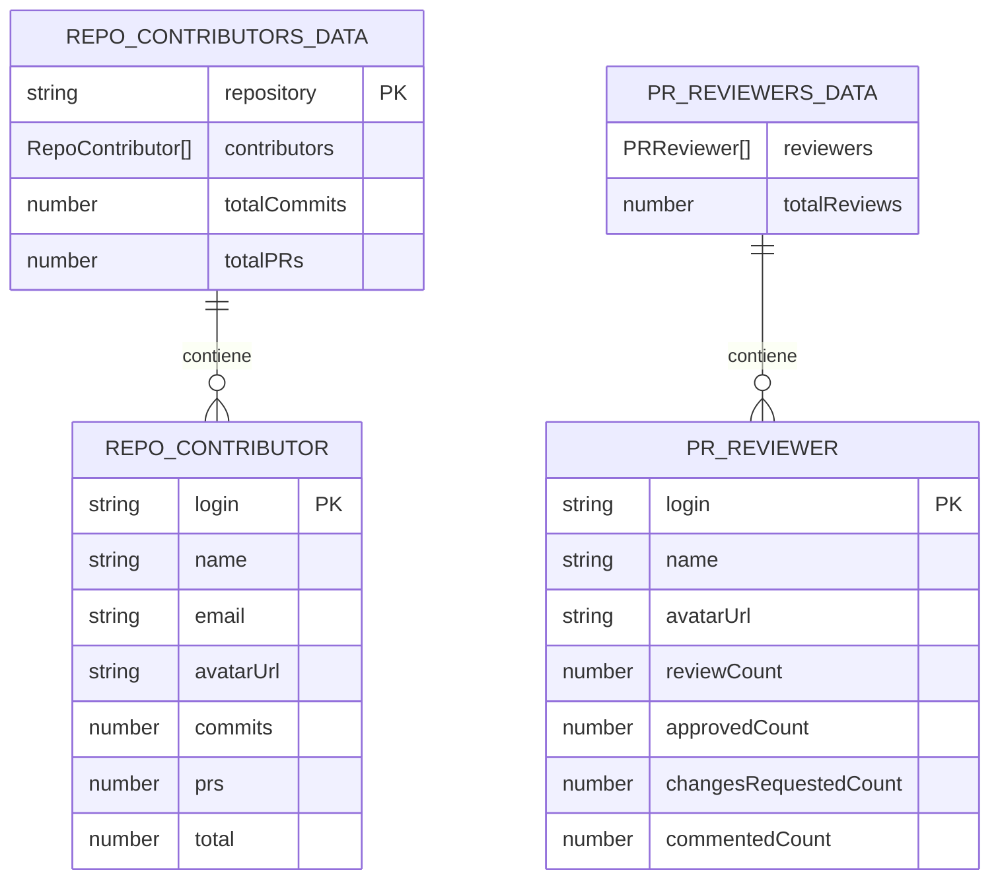
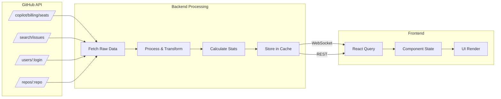

# Modelo de Datos

## Diagrama de Entidades

## Entidades de Contribuidores

## Descripción de Entidades

### DASHBOARD_DATA
Entidad principal que agrupa todos los datos del dashboard.

| Campo | Tipo | Descripción |
|-------|------|-------------|
| seats | SeatsStats | Estadísticas agregadas de licencias |
| seatsList | ProcessedSeat[] | Lista de usuarios con licencia |
| prs | PRStats | Estadísticas agregadas de PRs |
| prList | ProcessedPR[] | Lista de PRs individuales |
| languages | LanguageStats[] | Distribución por lenguajes |
| timezones | TimezoneActivity[] | Actividad por zona horaria |
| lastUpdated | string | Timestamp de última actualización |
| isLiveData | boolean | Si los datos son en tiempo real |
| dataSource | string | Origen de los datos |

### PROCESSED_SEAT
Usuario con licencia de Copilot procesado.

| Campo | Tipo | Nullable | Descripción |
|-------|------|----------|-------------|
| login | string | No | Username de GitHub (PK) |
| name | string | Sí | Nombre completo |
| email | string | Sí | Email del usuario |
| planType | string | No | Tipo de plan (business, enterprise) |
| createdAt | string | No | Fecha de asignación de licencia |
| lastActivityAt | string | No | Última actividad con Copilot |
| lastActivityEditor | string | No | Editor usado en última actividad |
| isActive | boolean | No | Si tiene actividad registrada |
| avatarUrl | string | Sí | URL del avatar |
| prCount | number | Sí | PRs de Copilot asignadas |
| agentUsageCount | number | Sí | Uso estimado de agentes |

### PROCESSED_PR
Pull Request creado por Copilot SWE Agent.

| Campo | Tipo | Nullable | Descripción |
|-------|------|----------|-------------|
| number | number | No | Número del PR (PK) |
| title | string | No | Título del PR |
| state | 'open' \| 'closed' | No | Estado actual |
| isMerged | boolean | No | Si fue integrado |
| repository | string | No | Repositorio (org/repo) |
| author | string | No | Autor (copilot-swe-agent) |
| createdAt | string | No | Fecha de creación |
| closedAt | string | Sí | Fecha de cierre |
| daysToClose | number | Sí | Días hasta cierre |
| url | string | No | URL del PR |
| customAgent | string | No | Agente personalizado usado |
| assignees | string[] | No | Usuarios asignados |

### PR_STATS
Estadísticas agregadas de Pull Requests.

| Campo | Tipo | Descripción |
|-------|------|-------------|
| total | number | Total de PRs |
| open | number | PRs abiertas |
| closed | number | PRs cerradas |
| merged | number | PRs integradas |
| rejected | number | PRs rechazadas |
| mergeRate | number | % de merge (merged/closed) |
| rejectionRate | number | % de rechazo |
| pendingRate | number | % pendientes (open/total) |
| topRepos | array | Top 10 repositorios |
| topAgents | array | Top 10 agentes |
| agentEffectiveness | array | Efectividad por agente |
| repoEffectiveness | array | Efectividad por repo |

## Flujo de Datos

## Índices y Búsquedas

| Búsqueda | Campos | Uso |
|----------|--------|-----|
| PRs por autor | `author = app/copilot-swe-agent` | Filtro principal |
| PRs por org | `org = copilot-full-capacity` | Scope de búsqueda |
| Usuarios activos | `lastActivityAt != '-'` | Filtro de adopción |
| Top repos | `repository` (GROUP BY + COUNT) | Ranking |
| Top agents | `customAgent` (GROUP BY + COUNT) | Ranking |
