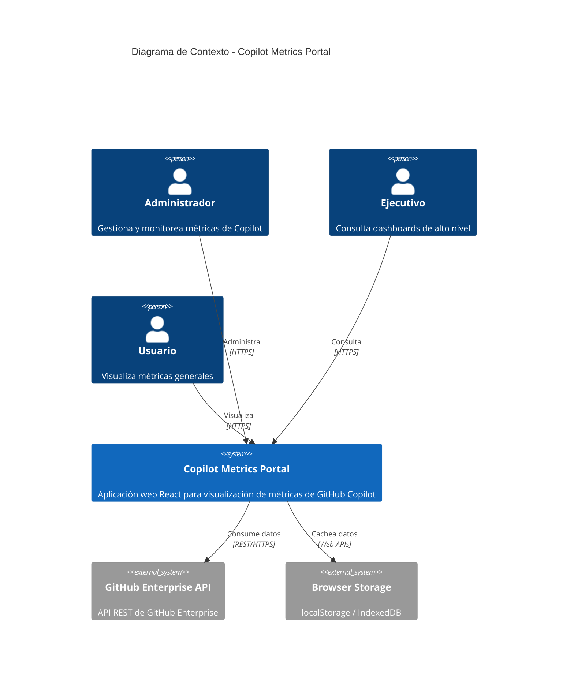
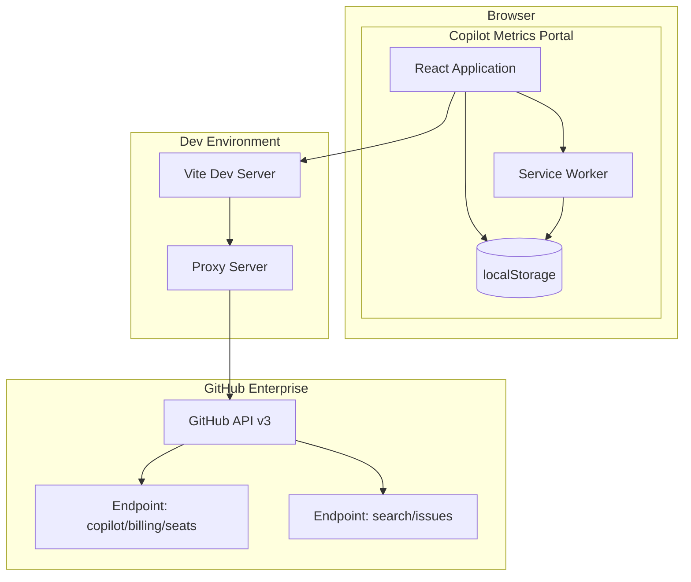
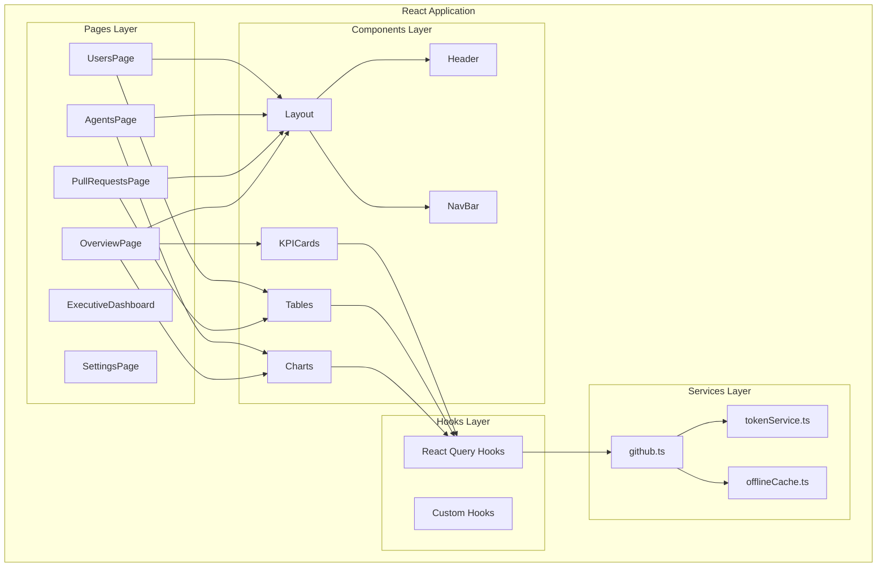
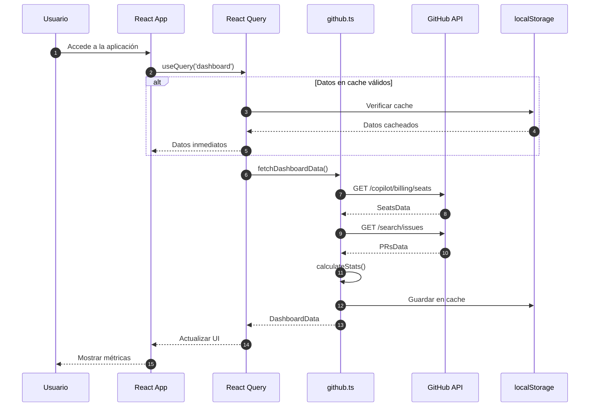
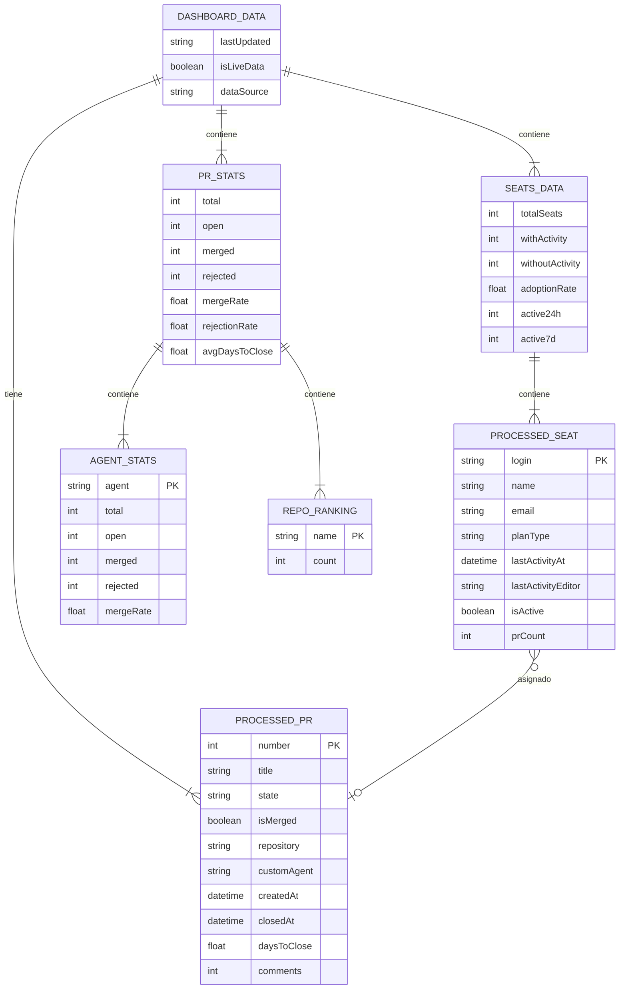
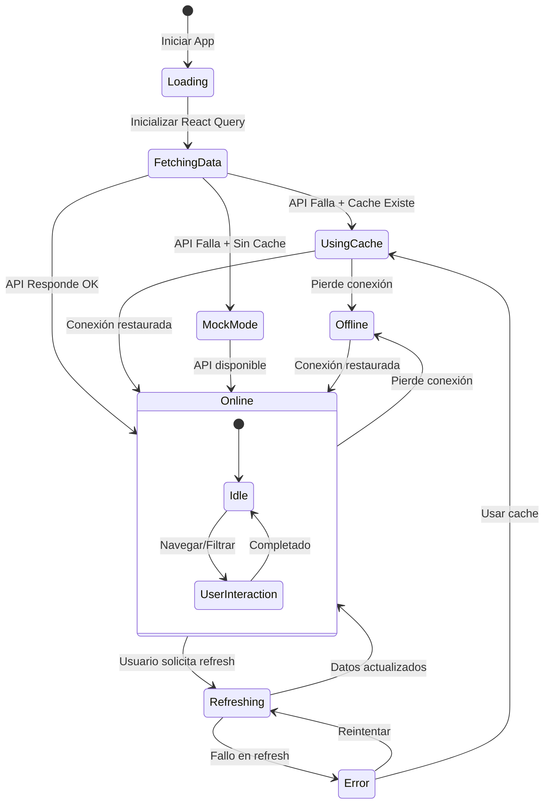

# Diagrama de Arquitectura del Sistema

## Diagrama de Contexto (C4 Level 1)

## Diagrama de Contenedores (C4 Level 2)

## Diagrama de Componentes (C4 Level 3)

## Flujo de Datos

## Modelo de Datos Consolidado

## Diagrama de Estados de la Aplicación

## Referencias

- [Documentación de Arquitectura](../overview.md)
- [Componentes](../components/comp-overview.md)
- [Servicios](../components/comp-services.md)
- [ADR-001: Stack Tecnológico](../decisions/adr-001-stack-tecnologico.md)
