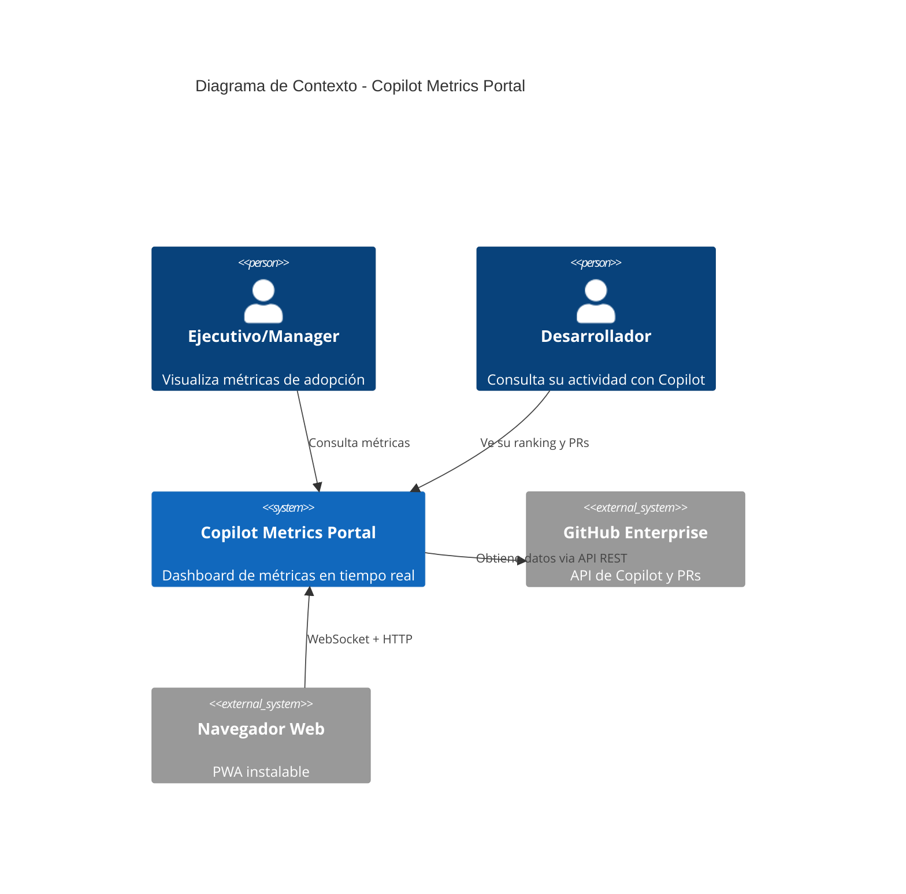
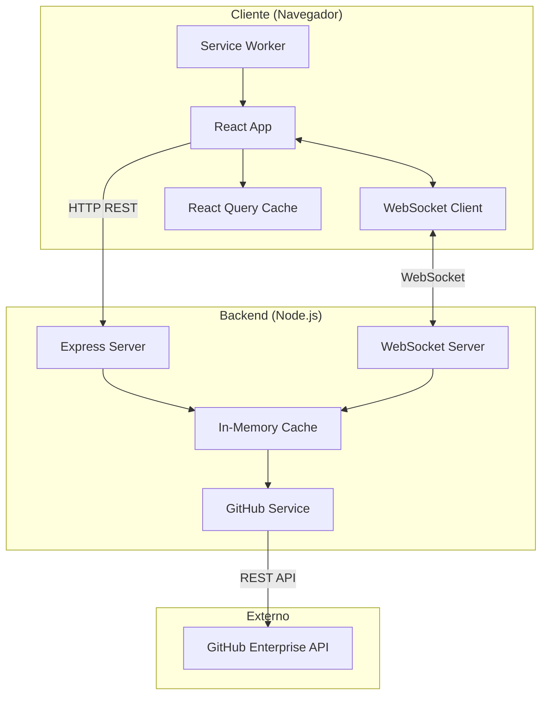
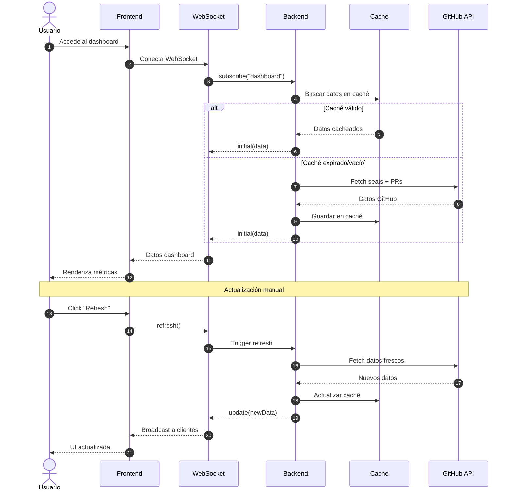

# Copilot Metrics Portal - Documentación de Arquitectura

## Visión General

### Propósito
El Copilot Metrics Portal es un dashboard ejecutivo para visualizar y analizar las métricas de adopción y uso de GitHub Copilot en la organización BBVA. Proporciona insights en tiempo real sobre la productividad del desarrollo asistido por IA.

### Alcance
El sistema incluye:
- Dashboard de métricas de adopción de Copilot
- Análisis de Pull Requests generadas por Copilot SWE Agent
- Rankings de usuarios y contribuidores
- Estadísticas de agentes personalizados
- Comunicación en tiempo real via WebSocket

No incluye:
- Gestión de usuarios o autenticación propia (usa token de GitHub)
- Modificación de datos en GitHub
- Histórico persistente (datos en memoria/caché)

### Contexto del Sistema



## Stack Tecnológico

| Capa | Tecnología | Versión | Propósito |
|------|------------|---------|-----------|
| Frontend | React | 19.x | UI componentes |
| Frontend | TypeScript | 5.9.x | Tipado estático |
| Frontend | Vite | 7.x | Build tool y dev server |
| Frontend | TailwindCSS | 3.4.x | Estilos utility-first |
| Frontend | React Query | 5.x | Gestión de estado servidor |
| Frontend | Recharts | 3.x | Gráficos y visualizaciones |
| Frontend | React Router | 7.x | Navegación SPA |
| Backend | Node.js | 22.x | Runtime servidor |
| Backend | Express | 4.x | HTTP server |
| Backend | ws | 8.x | WebSocket server |
| Backend | Axios | 1.x | Cliente HTTP |
| PWA | Vite PWA | 1.x | Service Worker y manifest |

## Arquitectura de Alto Nivel



## Principios de Arquitectura

1. **Tiempo Real First**: Comunicación WebSocket para actualizaciones instantáneas sin polling
2. **Offline Capable**: PWA con Service Worker para funcionamiento sin conexión
3. **Caché Inteligente**: Datos en memoria con TTL para reducir llamadas a GitHub API
4. **Componentes Reutilizables**: UI modular con componentes aislados y composables
5. **Type Safety**: TypeScript en toda la codebase para prevenir errores en runtime

## Flujo de Datos Principal



## Estructura de Directorios

```
copilot-metrics-portal/
├── src/                    # Frontend React
│   ├── components/         # Componentes UI reutilizables
│   ├── pages/             # Páginas/vistas principales
│   ├── hooks/             # Custom hooks (WebSocket, etc.)
│   ├── services/          # Servicios (GitHub, WebSocket)
│   ├── types/             # Definiciones TypeScript
│   └── assets/            # Imágenes y recursos
├── server/                # Backend Node.js
│   └── src/
│       ├── index.ts       # Entry point servidor
│       ├── cache.ts       # Sistema de caché
│       ├── githubService.ts # Cliente GitHub API
│       └── types.ts       # Tipos compartidos
├── public/                # Assets estáticos
└── docs/                  # Documentación
```

## Índice de Documentación

### Componentes
- [Frontend React](components/comp-frontend.md)
- [Backend WebSocket](components/comp-backend.md)
- [Sistema de Caché](components/comp-cache.md)
- [Servicio GitHub](components/comp-github-service.md)

### Diagramas
- [Arquitectura General](diagrams/architecture.md)
- [Flujo de Datos](diagrams/data-flow.md)
- [Modelo de Datos](diagrams/data-model.md)

### Decisiones de Arquitectura (ADR)
- [ADR-001: WebSocket vs Polling](decisions/adr-001-websocket.md)
- [ADR-002: Caché en Memoria](decisions/adr-002-memory-cache.md)
- [ADR-003: PWA para Offline](decisions/adr-003-pwa.md)
