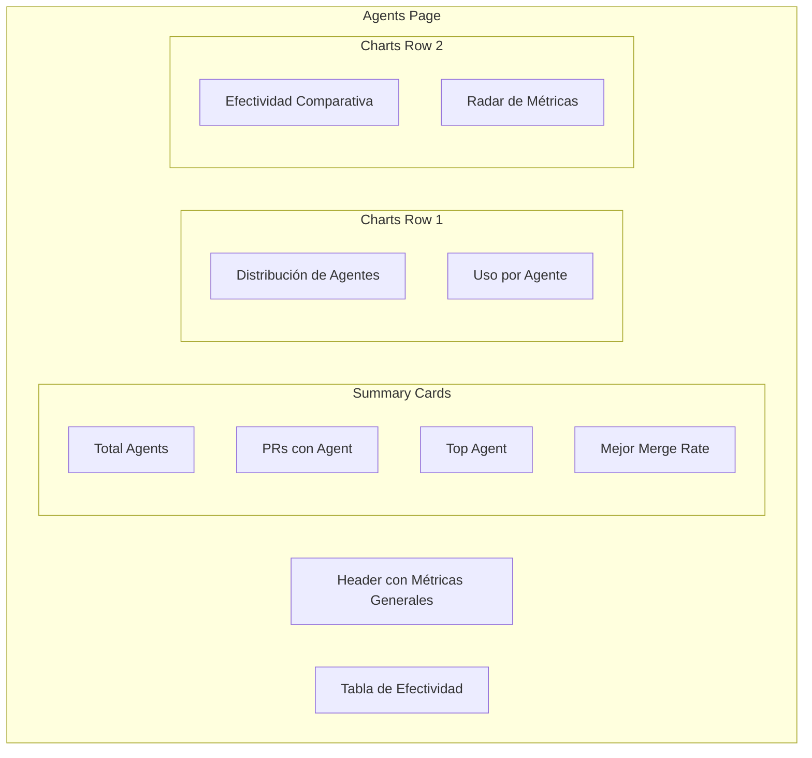
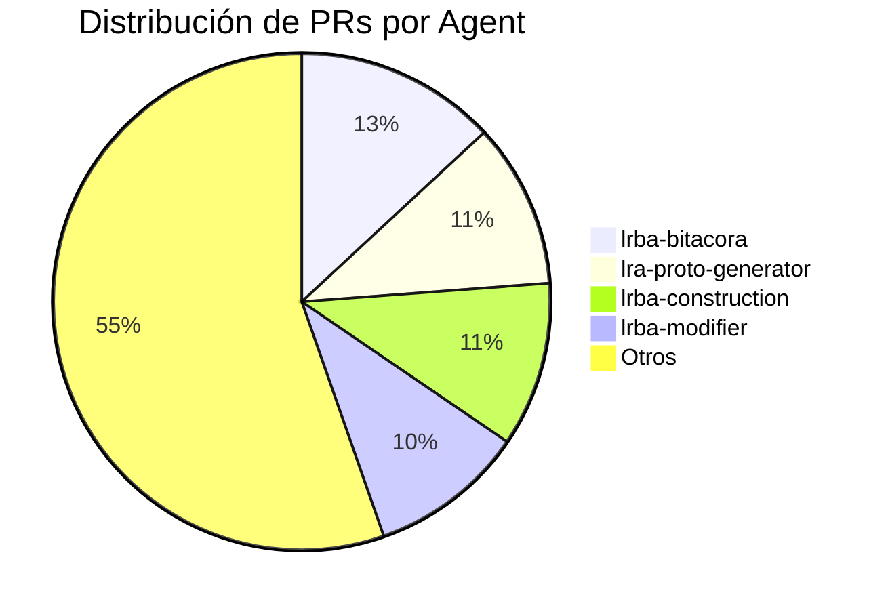
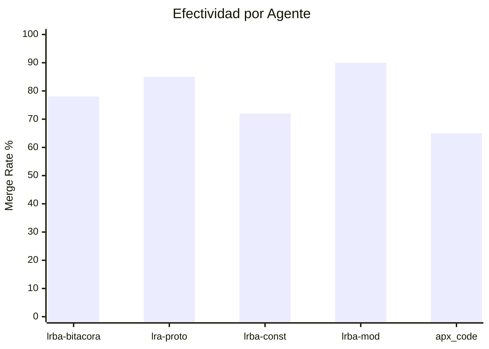
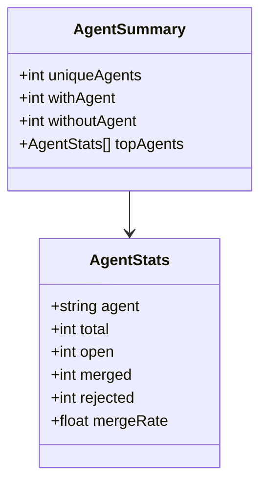
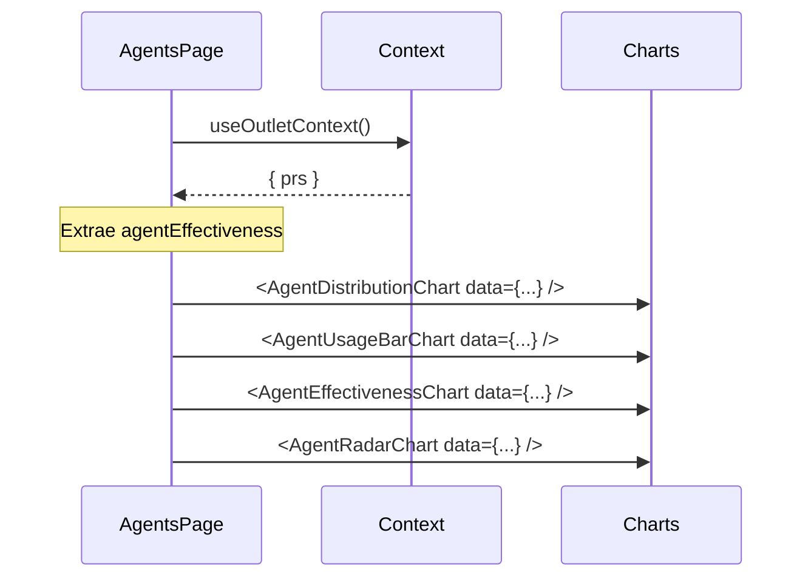

# F003 - Análisis de Custom Agents

**ID**: F003
**Módulo**: Agents
**Estado**: Activo

## Resumen

La página de Agents proporciona un análisis detallado del uso y efectividad de los Custom Agents de Copilot. Permite identificar qué agentes son más utilizados y cuáles tienen mejor tasa de éxito.

## Diagrama de la Página



## Funcionalidades

### 1. Summary Cards

Cards con métricas clave de agentes:

| Card | Métrica | Descripción |
|------|---------|-------------|
| Total Agents | uniqueAgents | Número de agentes distintos |
| PRs con Agent | withAgent | PRs que usan custom agent |
| Top Agent | topAgents[0] | Agente más utilizado |
| Best Merge Rate | max(mergeRate) | Agente más efectivo |

### 2. Gráfico de Distribución



**Características:**
- Pie chart con top 5 agents
- Resto agrupado como "Otros"
- Tooltip con detalle
- Colores diferenciados

### 3. Gráfico de Uso (Bar Chart)

Barras horizontales mostrando cantidad de PRs por agente.

### 4. Gráfico de Efectividad



Compara merge rate entre agentes.

### 5. Radar Chart

Gráfico de radar que muestra múltiples métricas por agente:
- Total PRs
- Merged
- Open
- Merge Rate

### 6. Tabla de Efectividad

| Columna | Descripción |
|---------|-------------|
| Agent | Nombre del agente |
| Total | PRs totales |
| Open | PRs abiertos |
| Merged | PRs mergeados |
| Rejected | PRs rechazados |
| Merge Rate | % de éxito |

## Casos de Uso

### CU001 - Analizar agente específico

**Actor**: Administrador

**Flujo:**
1. Usuario accede a página Agents
2. Sistema muestra gráficos comparativos
3. Usuario identifica agente de interés
4. Usuario revisa métricas en tabla

### CU002 - Identificar agente más efectivo

**Actor**: Ejecutivo

**Flujo:**
1. Usuario revisa Summary Cards
2. Sistema muestra "Mejor Merge Rate"
3. Usuario verifica en gráfico de efectividad
4. Usuario toma decisiones de mejora

## Modelo de Datos



## Cálculos

### Merge Rate por Agente

```
mergeRate = (merged / (merged + rejected)) × 100
```

### Distribución

```
percentage = (agentPRs / totalPRsWithAgent) × 100
```

## Métricas Derivadas

| Métrica | Cálculo | Uso |
|---------|---------|-----|
| Efectividad | mergeRate | Comparar agentes |
| Popularidad | total / totalWithAgent | Uso relativo |
| Pendientes | open / total | Carga de trabajo |

## Reglas de Negocio

| ID | Regla |
|----|-------|
| RN001 | Solo se muestran agentes con al menos 1 PR |
| RN002 | "Sin agente" se excluye de rankings |
| RN003 | Merge rate solo con PRs cerrados |

## Flujo de Datos



## Insights Automáticos

El sistema podría mostrar insights como:
- "El agente X tiene 20% más efectividad que el promedio"
- "3 agentes no se han usado en los últimos 7 días"
- "El agente Y tiene el mayor volumen de PRs abiertos"

## Referencias

- [Documentación de Charts](../../architecture/components/comp-overview.md)
- [Servicio GitHub](../../architecture/components/comp-services.md)
