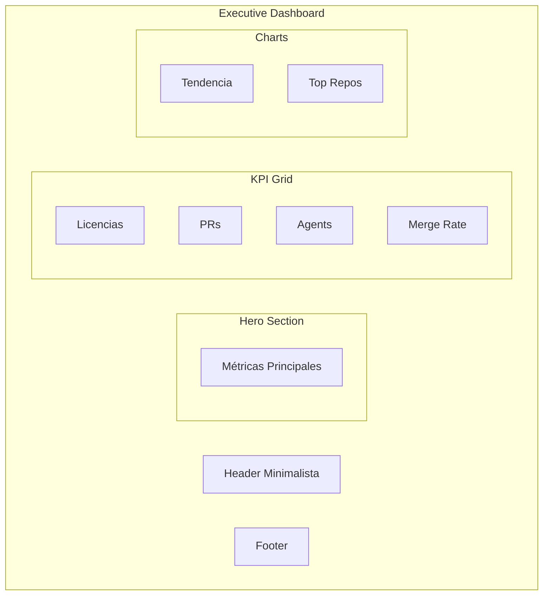
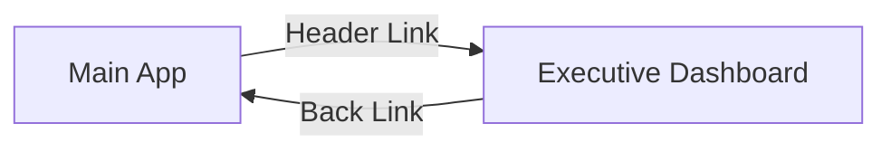
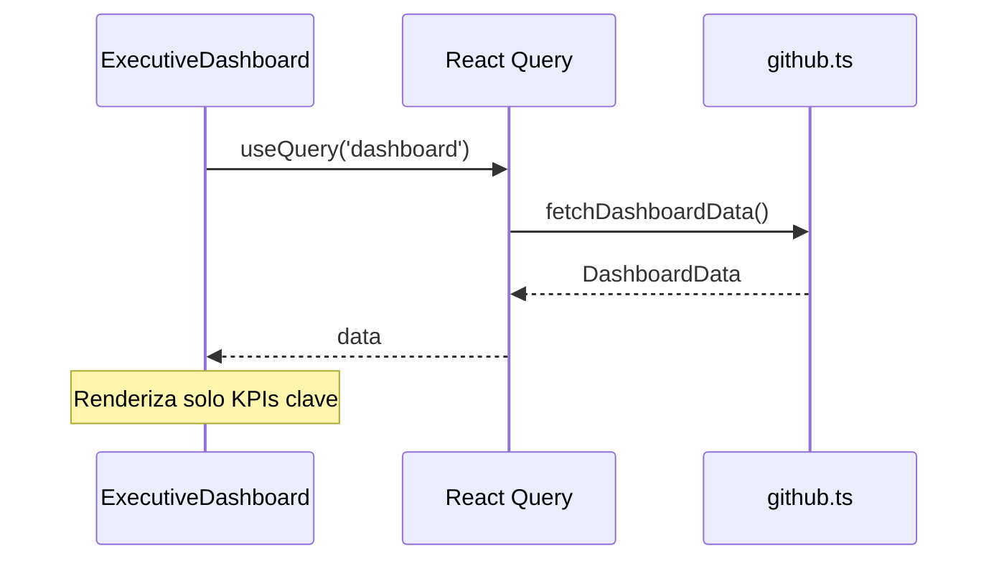

# F005 - Dashboard Ejecutivo

**ID**: F005
**Módulo**: Executive
**Estado**: Activo

## Resumen

El Dashboard Ejecutivo es una vista simplificada y de alto impacto diseñada para presentaciones a directivos. Muestra los KPIs más relevantes en un formato visualmente atractivo y fácil de comprender.

## Diagrama de la Página

## Características Especiales

### 1. Layout Independiente

- No usa el Layout principal con NavBar
- Header minimalista con link de regreso
- Diseñado para presentaciones en pantalla completa

### 2. Diseño Premium

| Elemento | Característica |
|----------|----------------|
| Fondo | Gradiente oscuro |
| Cards | Efecto glassmorphism |
| Números | Animados con CountUp |
| Colores | Paleta ejecutiva |

### 3. Métricas Destacadas

Solo se muestran las métricas más relevantes:

| Métrica | Propósito |
|---------|-----------|
| Total Licencias | Inversión en Copilot |
| Tasa de Adopción | ROI de licencias |
| PRs Totales | Productividad generada |
| Merge Rate | Calidad del código |
| Custom Agents | Innovación/personalización |

## Casos de Uso

### CU001 - Presentación a directivos

**Actor**: Ejecutivo

**Flujo:**
1. Ejecutivo accede via link directo (/executive)
2. Sistema muestra dashboard premium
3. Ejecutivo presenta métricas
4. Audiencia comprende estado de Copilot

### CU002 - Revisión rápida de KPIs

**Actor**: Manager

**Flujo:**
1. Manager accede desde Header
2. Sistema carga vista ejecutiva
3. Manager revisa métricas clave
4. Manager vuelve a vista detallada si necesita

## Diferencias con Overview

| Aspecto | Overview | Executive |
|---------|----------|-----------|
| Layout | Con NavBar | Sin NavBar |
| Detalle | Alto | Resumido |
| Gráficos | Múltiples | Seleccionados |
| Objetivo | Análisis | Presentación |
| Acceso | Navegación | Link directo |

## Navegación

**URL**: `/executive`

## Diseño Visual

### Paleta de Colores

| Uso | Color |
|-----|-------|
| Fondo | #0f172a (slate-900) |
| Cards | rgba(255,255,255,0.1) |
| Texto | #ffffff |
| Acento | #3b82f6 (blue-500) |
| Éxito | #22c55e (green-500) |

### Tipografía

| Elemento | Tamaño | Peso |
|----------|--------|------|
| Título principal | 3xl | Bold |
| KPI Value | 5xl | Bold |
| KPI Label | lg | Normal |
| Subtexto | sm | Light |

## Animaciones

- Fade in escalonado de elementos
- CountUp en números principales
- Transiciones suaves en hover

## Responsive

| Breakpoint | Comportamiento |
|------------|----------------|
| Mobile | Stack vertical |
| Tablet | Grid 2 columnas |
| Desktop | Grid 4 columnas |
| Presentación | Optimizado para 1080p |

## Modo Presentación

Consideraciones para uso en presentaciones:
- Colores de alto contraste
- Texto legible a distancia
- Sin elementos interactivos distractores
- Auto-refresh deshabilitado

## Flujo de Datos

## Métricas Mostradas

| Categoría | Métricas |
|-----------|----------|
| Adopción | Licencias, Con Actividad, Tasa |
| Productividad | Total PRs, Merged |
| Calidad | Merge Rate, Avg Days |
| Innovación | Custom Agents, PRs con Agent |

## Referencias

- [Página Overview](feat-overview.md)
- [Componentes](../../architecture/components/comp-overview.md)
