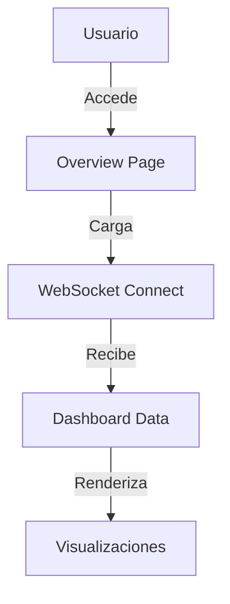
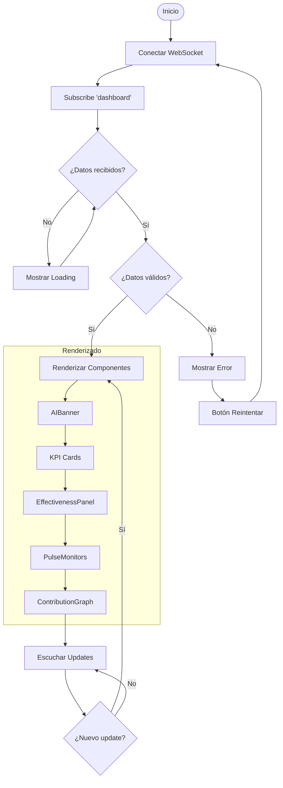
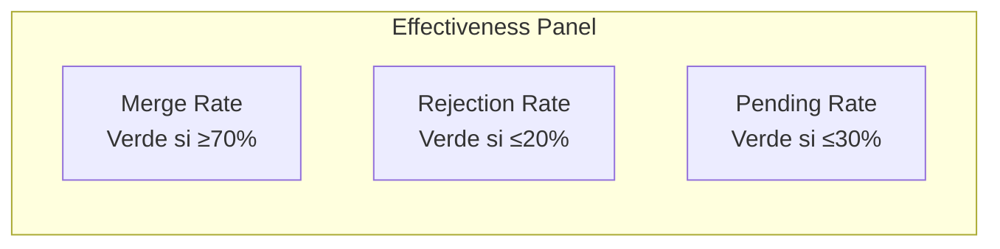

# Funcionalidad: Overview Page

**ID**: F002
**Módulo**: Principal
**Estado**: Activo

## Resumen

La página Overview es la vista principal del portal que muestra un resumen ejecutivo de las métricas de GitHub Copilot, incluyendo banner de AI, monitores de actividad en tiempo real, y gráfico de contribuciones estilo GitHub.

## Casos de Uso

### Caso de Uso Principal: Ver Resumen de Métricas



**Actor**: Cualquier usuario (Ejecutivo, Developer Lead, Desarrollador)

**Precondiciones**:
- Usuario tiene acceso al portal
- Backend WebSocket está disponible
- Token de GitHub configurado

**Flujo Principal**:
1. El usuario accede a la URL raíz (`/`)
2. El sistema conecta via WebSocket
3. El sistema recibe los datos del dashboard
4. El sistema renderiza el AIBanner con métricas principales
5. El sistema muestra los KPIs de PRs
6. El sistema renderiza el panel de efectividad
7. El sistema muestra los monitores de pulso de actividad
8. El sistema renderiza el gráfico de contribuciones

**Postcondiciones**:
- Usuario ve todas las métricas actualizadas
- WebSocket mantiene conexión para updates

## Diagrama de Flujo Detallado



## Componentes de la Vista

### 1. AIBanner
Banner hero con métricas principales de Copilot SWE Agent.

| Métrica | Descripción |
|---------|-------------|
| Agents | Número de agentes únicos |
| Automatización | % de PRs con Custom Agent |
| Productividad | PRs por agente |
| Merge Rate | % de PRs integradas |
| Velocidad | Días promedio hasta cierre |
| En Progreso | PRs abiertas actualmente |

### 2. KPI Cards
Tarjetas con métricas de Pull Requests.

| KPI | Color | Descripción |
|-----|-------|-------------|
| Total PRs | Azul | Todas las PRs del agente |
| PRs Abiertas | Naranja | PRs pendientes |
| PRs Merged | Púrpura | PRs integradas |
| PRs Rechazadas | Rojo | PRs cerradas sin merge |
| Custom Agents | Cyan | Agentes distintos |
| Con Custom Agent | Verde | PRs con agente asignado |

### 3. EffectivenessPanel
Dashboard de efectividad con tres métricas clave.



### 4. PulseMonitor
Dos monitores de actividad en tiempo real.

| Monitor | Cálculo |
|---------|---------|
| Actividad de PRs | PRs últimas 24h vs promedio diario |
| Velocidad de Merges | Merges últimas 24h vs promedio diario |

**Escala**:
- 0% = Sin actividad
- ~33% = Actividad normal (igual al promedio)
- 100% = Actividad excepcional (3x promedio)

### 5. ContributionGraph
Gráfico estilo GitHub con actividad diaria.

## Reglas de Negocio

| ID | Regla | Descripción |
|----|-------|-------------|
| RN-OV-001 | Cálculo de actividad | `(prsLast24h / avgPRsPerDay) * 33.3` capped at 100 |
| RN-OV-002 | Nivel de estado | Alta ≥70%, Normal ≥40%, Baja <40% |
| RN-OV-003 | Contribution Graph | Últimos 7 meses de actividad |

## Interfaz de Usuario

### Layout de la Página

```
┌──────────────────────────────────────────┐
│              AIBanner                     │
│  [Agents] [Auto%] [Prod] [Merge] [Vel]   │
├──────────────────────────────────────────┤
│           KPI Cards (6 columnas)          │
│ [Total] [Open] [Merged] [Reject] [Ag] [+]│
├──────────────────────────────────────────┤
│          Effectiveness Panel              │
│  [Merge Rate] [Rejection] [Pending]      │
├──────────────────────────────────────────┤
│  Contribution Graph (Últimos 7 meses)    │
├───────────────────┬──────────────────────┤
│   PulseMonitor    │    PulseMonitor      │
│   (Actividad)     │    (Merges)          │
└───────────────────┴──────────────────────┘
```

## Mensajes del Sistema

| Código | Tipo | Mensaje |
|--------|------|---------|
| OV-MSG-001 | Info | "Datos actualizados" (toast) |
| OV-MSG-002 | Legend | "¿Cómo se calcula?" (expandible) |

## Dependencias

**Funcionalidades relacionadas**:
- [F001 - Executive Dashboard](feat-executive-dashboard.md)
- [F007 - Tiempo Real WebSocket](feat-realtime.md)

**Componentes**:
- AIBanner
- KPICard
- EffectivenessPanel
- PulseMonitor
- ContributionGraph

**Servicios**:
- WebSocket Service
- React Query Cache

## Historial de Cambios

| Versión | Fecha | Autor | Cambios |
|---------|-------|-------|---------|
| 1.0 | 2026-02 | Equipo | Versión inicial |
| 1.1 | 2026-02 | Equipo | Ajuste escala PulseMonitor |
| 1.2 | 2026-02 | Equipo | Añadidas leyendas explicativas |
