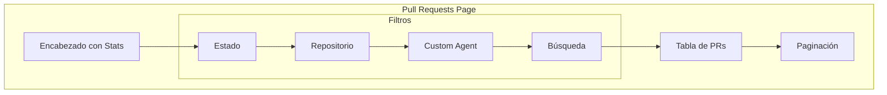
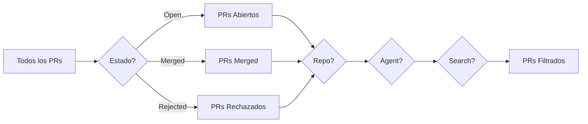
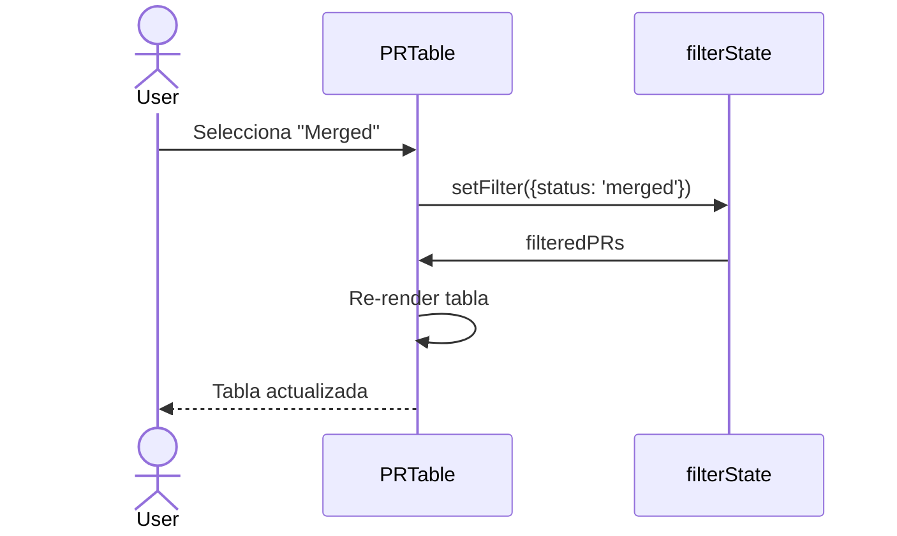
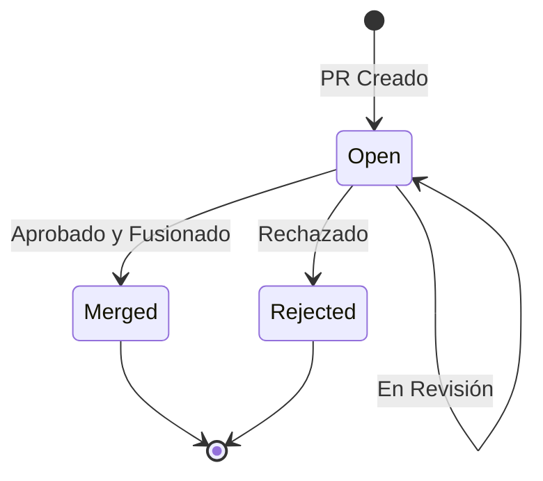
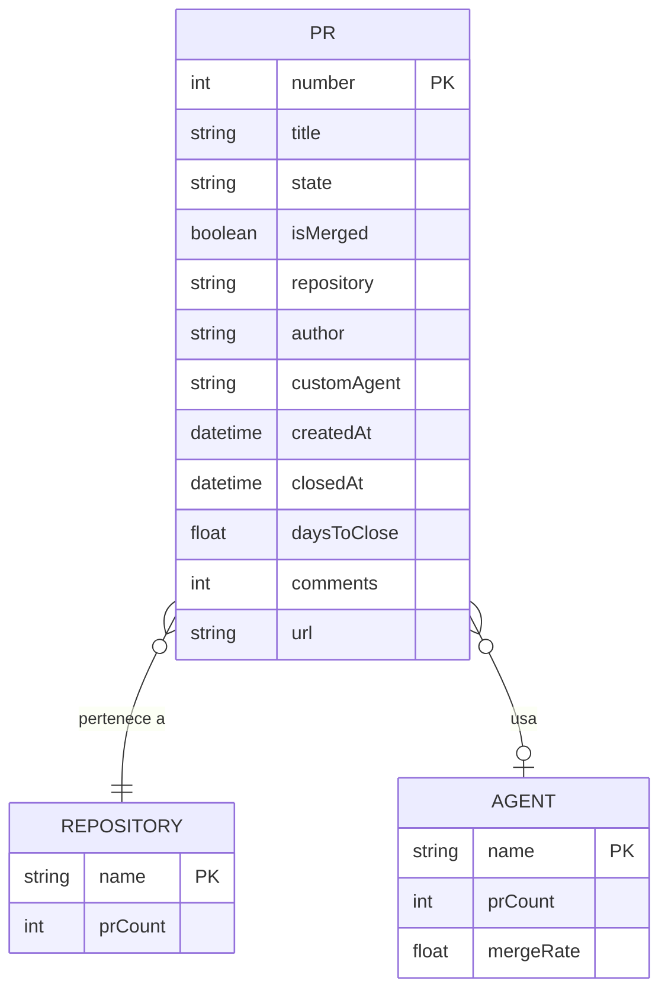

# F002 - Gestión de Pull Requests

**ID**: F002
**Módulo**: Pull Requests
**Estado**: Activo

## Resumen

La página de Pull Requests permite visualizar, filtrar y analizar todos los PRs creados por GitHub Copilot SWE Agent en la organización.

## Diagrama de la Página

## Funcionalidades

### 1. Estadísticas de Cabecera

KPIs rápidos del estado actual de PRs:

| KPI | Descripción |
|-----|-------------|
| Total | Cantidad total de PRs |
| Open | PRs pendientes |
| Merged | PRs fusionados |
| Rejected | PRs rechazados |

### 2. Sistema de Filtros

**Filtros disponibles:**

| Filtro | Tipo | Opciones |
|--------|------|----------|
| Estado | Select | All, Open, Merged, Rejected |
| Repositorio | Select | Lista dinámica de repos |
| Custom Agent | Select | Lista dinámica de agents |
| Búsqueda | Text | Busca en título y número |

### 3. Tabla de PRs

**Columnas:**

| Columna | Descripción | Ordenable |
|---------|-------------|-----------|
| # | Número del PR | Sí |
| Título | Título del PR | Sí |
| Repositorio | Nombre del repo | Sí |
| Estado | Open/Merged/Rejected | Sí |
| Custom Agent | Agente utilizado | Sí |
| Creado | Fecha de creación | Sí |
| Cerrado | Fecha de cierre | Sí |
| Días | Tiempo hasta cierre | Sí |
| Comentarios | Cantidad | Sí |

### 4. Paginación

- Items por página: 10, 25, 50, 100
- Navegación: Primera, Anterior, Siguiente, Última
- Indicador: "Mostrando X-Y de Z"

## Casos de Uso

### CU001 - Listar PRs

**Actor**: Administrador

**Flujo:**
1. Usuario navega a "Pull Requests"
2. Sistema carga lista de PRs
3. Sistema muestra tabla paginada
4. Usuario puede navegar entre páginas

### CU002 - Filtrar por Estado

**Actor**: Administrador

**Flujo:**
1. Usuario selecciona estado "Merged"
2. Sistema filtra PRs
3. Sistema actualiza tabla
4. Sistema actualiza contadores

### CU003 - Ordenar por columna

**Actor**: Administrador

**Flujo:**
1. Usuario hace clic en encabezado de columna
2. Sistema ordena ascendente
3. Usuario hace clic de nuevo
4. Sistema ordena descendente

### CU004 - Buscar PR específico

**Actor**: Administrador

**Flujo:**
1. Usuario escribe en campo de búsqueda
2. Sistema aplica debounce (300ms)
3. Sistema filtra por título o número
4. Sistema muestra resultados

## Diagrama de Estados de PR

## Modelo de Datos

## Reglas de Negocio

| ID | Regla | Descripción |
|----|-------|-------------|
| RN001 | Estado derivado | Si closed_at != null y merged_at == null → Rejected |
| RN002 | Días de cierre | Solo calculado si PR está cerrado |
| RN003 | Sin agente | PRs sin custom agent muestran "-" |

## Validaciones

| Campo | Validación |
|-------|------------|
| Búsqueda | Mínimo 2 caracteres para activar |
| Paginación | Página no puede ser < 1 |

## Acciones Disponibles

| Acción | Descripción | Ubicación |
|--------|-------------|-----------|
| Ver PR | Abre PR en GitHub | Click en número |
| Copiar URL | Copia link del PR | Icono en fila |
| Exportar | Descarga CSV (futuro) | Header |

## Mensajes del Sistema

| Código | Tipo | Mensaje |
|--------|------|---------|
| MSG001 | Info | "No se encontraron PRs con los filtros seleccionados" |
| MSG002 | Info | "Mostrando X de Y resultados" |

## Responsive

| Breakpoint | Comportamiento |
|------------|----------------|
| Mobile | Tabla con scroll horizontal |
| Tablet | Columnas reducidas |
| Desktop | Todas las columnas visibles |

## Referencias

- [Servicio GitHub](../../architecture/components/comp-services.md)
- [Tipos de Datos](../../architecture/overview.md)
