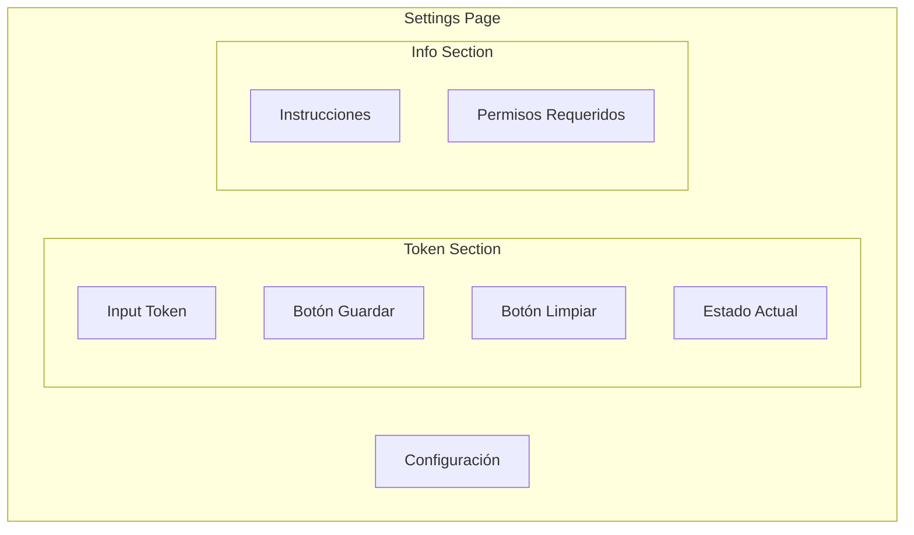
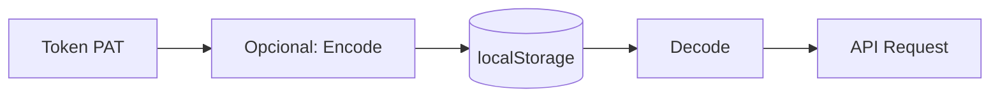
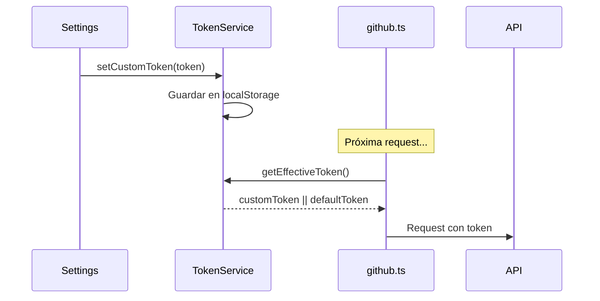

# F006 - Configuración

**ID**: F006
**Módulo**: Settings
**Estado**: Activo

## Resumen

La página de Configuración permite a los usuarios personalizar la aplicación, principalmente la gestión del token de API de GitHub para acceder a datos reales.

## Diagrama de la Página



## Funcionalidades

### 1. Gestión de Token

#### Establecer Token

**Flujo:**
1. Usuario ingresa token en campo
2. Token se valida (formato básico)
3. Token se guarda en localStorage
4. Sistema muestra confirmación

#### Limpiar Token

**Flujo:**
1. Usuario hace clic en "Limpiar"
2. Sistema elimina token de localStorage
3. Sistema vuelve a token por defecto (demo)

### 2. Estado del Token

| Estado | Indicador | Descripción |
|--------|-----------|-------------|
| Custom | Badge verde | Token personalizado activo |
| Default | Badge gris | Usando token demo |
| Invalid | Badge rojo | Token inválido |

## Casos de Uso

### CU001 - Configurar token personal

**Actor**: Administrador

**Precondiciones:**
- Usuario tiene PAT de GitHub con permisos correctos

**Flujo:**
1. Usuario navega a Settings
2. Usuario ingresa su PAT
3. Usuario hace clic en "Guardar"
4. Sistema valida formato
5. Sistema guarda token
6. Sistema muestra confirmación
7. Próximas consultas usan token personal

**Postcondiciones:**
- Token guardado en localStorage
- API usa token personal

### CU002 - Volver a modo demo

**Actor**: Usuario

**Flujo:**
1. Usuario navega a Settings
2. Usuario hace clic en "Limpiar Token"
3. Sistema elimina token personalizado
4. Sistema muestra confirmación
5. Próximas consultas usan datos mock

## Diagrama de Flujo

```mermaid
flowchart TD
    A[Abrir Settings] --> B{Token Custom?}
    B -->|Sí| C[Mostrar estado "Personalizado"]
    B -->|No| D[Mostrar estado "Demo"]
    
    C --> E{Acción?}
    D --> E
    
    E -->|Guardar Nuevo| F[Validar Token]
    E -->|Limpiar| G[Eliminar Token]
    
    F --> H{Válido?}
    H -->|Sí| I[Guardar en localStorage]
    H -->|No| J[Mostrar Error]
    
    I --> K[Actualizar UI]
    G --> K
    J --> E
```

## Seguridad del Token

### Almacenamiento



**Consideraciones:**
- Token se guarda en localStorage del navegador
- No se transmite a ningún servidor propio
- Solo se envía a GitHub API
- Se recomienda usar tokens con permisos mínimos

### Permisos Requeridos

| Permiso | Propósito |
|---------|-----------|
| `read:org` | Leer datos de organización |
| `admin:org` | Acceso a billing de Copilot |
| `repo` | Leer PRs y issues |

## Instrucciones para Crear Token

1. Ir a GitHub Settings > Developer Settings
2. Personal Access Tokens > Tokens (classic)
3. Generate new token
4. Seleccionar permisos requeridos
5. Copiar token generado
6. Pegar en Settings de la aplicación

## Modelo de Datos

```typescript
interface TokenConfig {
  customToken: string | null;
  isValid: boolean;
  lastValidated: Date | null;
}
```

## Validaciones

| Campo | Validación | Mensaje |
|-------|------------|---------|
| Token | No vacío | "El token no puede estar vacío" |
| Token | Formato PAT | "Formato de token inválido" |

## Persistencia

| Dato | Storage | Clave |
|------|---------|-------|
| Token | localStorage | `copilot_metrics_token` |

## Mensajes del Sistema

| Código | Tipo | Mensaje |
|--------|------|---------|
| MSG001 | Éxito | "Token guardado correctamente" |
| MSG002 | Éxito | "Token eliminado" |
| ERR001 | Error | "Token inválido" |
| INFO01 | Info | "Usando datos de demostración" |

## Flujo de Token en API



## Referencias

- [Token Service](../../architecture/components/comp-services.md)
- [Documentación GitHub PAT](https://docs.github.com/en/authentication/keeping-your-account-and-data-secure/managing-your-personal-access-tokens)
