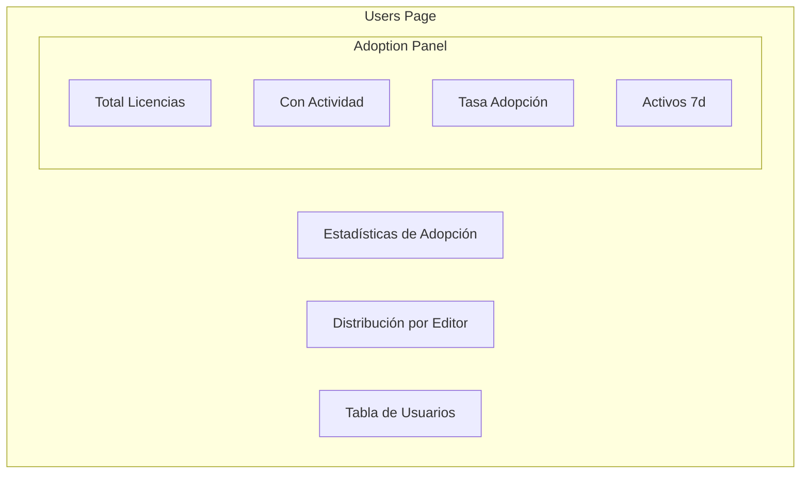
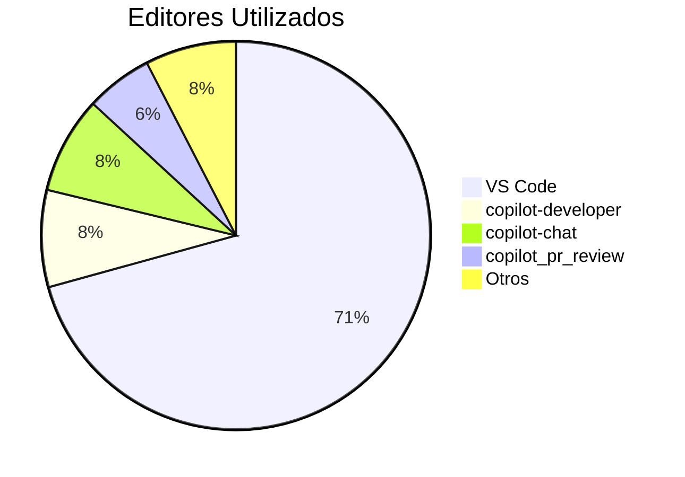
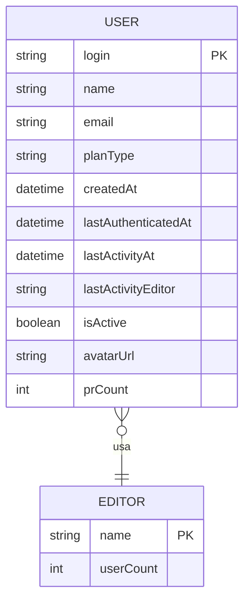
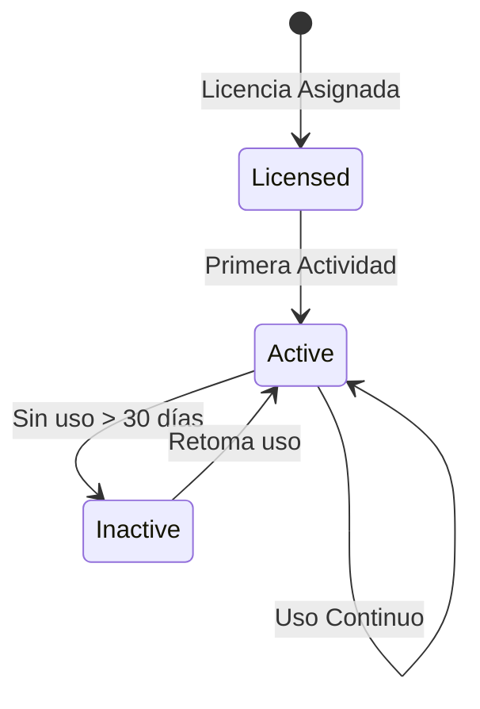
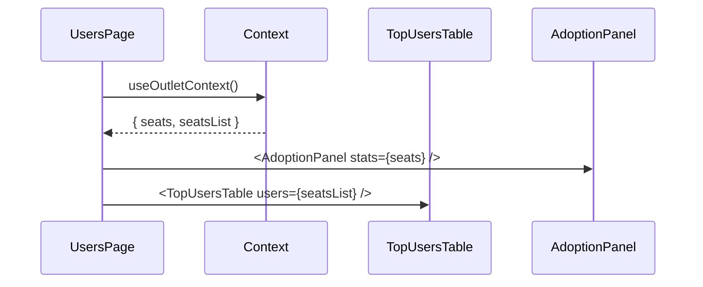

# F004 - Gestión de Usuarios

**ID**: F004
**Módulo**: Users
**Estado**: Activo

## Resumen

La página de Usuarios muestra información sobre los usuarios con licencia de GitHub Copilot, su nivel de actividad, editores utilizados y PRs asignados.

## Diagrama de la Página



## Funcionalidades

### 1. Panel de Adopción

Muestra métricas de adopción de Copilot:

| Métrica | Descripción | Visual |
|---------|-------------|--------|
| Total Licencias | Seats asignados | Número grande |
| Con Actividad | Usuarios activos | Número + badge |
| Sin Actividad | Usuarios inactivos | Número en gris |
| Tasa de Adopción | % uso efectivo | Barra de progreso |
| Activos 24h | Uso reciente | Badge verde |
| Activos 7d | Uso semanal | Badge azul |

### 2. Distribución por Editor



Muestra qué editores/herramientas usan los desarrolladores.

### 3. Tabla de Usuarios

**Columnas:**

| Columna | Descripción | Ordenable |
|---------|-------------|-----------|
| Usuario | Login del usuario | Sí |
| Nombre | Nombre completo | Sí |
| Plan | Tipo de licencia | Sí |
| Última Actividad | Timestamp | Sí |
| Editor | Último editor usado | Sí |
| PRs Asignados | Cantidad de PRs | Sí |
| Estado | Activo/Inactivo | Sí |

## Casos de Uso

### CU001 - Ver adopción general

**Actor**: Administrador

**Flujo:**
1. Usuario accede a "Users"
2. Sistema muestra panel de adopción
3. Usuario ve tasa de adopción
4. Usuario identifica usuarios inactivos

### CU002 - Identificar usuarios inactivos

**Actor**: Administrador

**Flujo:**
1. Usuario ordena tabla por "Última Actividad"
2. Sistema muestra usuarios sin actividad primero
3. Usuario revisa lista
4. Usuario puede tomar acciones (fuera del sistema)

### CU003 - Analizar uso de editores

**Actor**: Administrador

**Flujo:**
1. Usuario revisa gráfico de editores
2. Sistema muestra distribución
3. Usuario identifica herramientas populares

## Modelo de Datos



## Cálculos de Métricas

### Tasa de Adopción

```
adoptionRate = (usersWithActivity / totalSeats) × 100
```

### Usuarios Activos por Período

```
active24h = count(lastActivityAt > now - 24h)
active7d = count(lastActivityAt > now - 7d)
active30d = count(lastActivityAt > now - 30d)
```

## Estados de Usuario



## Indicadores Visuales

| Indicador | Condición | Visual |
|-----------|-----------|--------|
| Muy activo | Actividad < 24h | Badge verde brillante |
| Activo | Actividad < 7d | Badge verde |
| Poco activo | Actividad < 30d | Badge amarillo |
| Inactivo | Sin actividad | Badge gris |

## Reglas de Negocio

| ID | Regla |
|----|-------|
| RN001 | Usuario activo = tiene lastActivityAt |
| RN002 | prCount se calcula de PRs de Copilot SWE Agent asignados |
| RN003 | Editor "-" significa sin actividad registrada |

## Flujo de Datos



## Filtros Disponibles

| Filtro | Opciones |
|--------|----------|
| Estado | Todos, Activos, Inactivos |
| Editor | Lista dinámica |
| Actividad | 24h, 7d, 30d, Sin actividad |

## Ordenación por Defecto

1. PRs Asignados (descendente)
2. Última Actividad (más reciente primero)

## Acciones de Fila

| Acción | Descripción |
|--------|-------------|
| Ver perfil | Abre perfil en GitHub |
| Ver PRs | Filtra PRs de ese usuario |

## Responsive

| Breakpoint | Comportamiento |
|------------|----------------|
| Mobile | Cards apiladas, tabla scroll |
| Desktop | Layout completo |

## Referencias

- [Panel de Adopción](../../architecture/components/comp-overview.md)
- [Servicio de Seats](../../architecture/components/comp-services.md)
