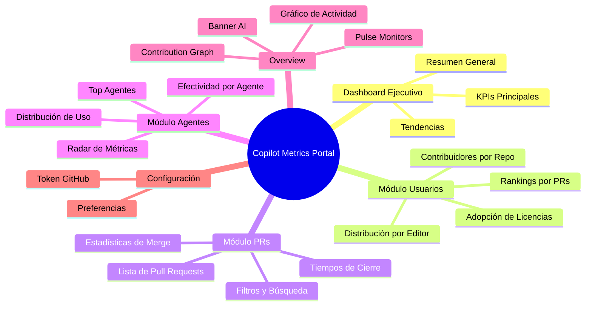
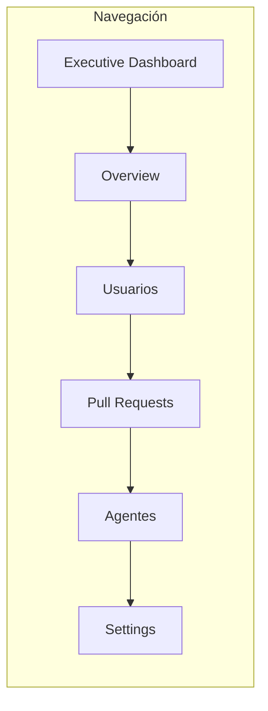
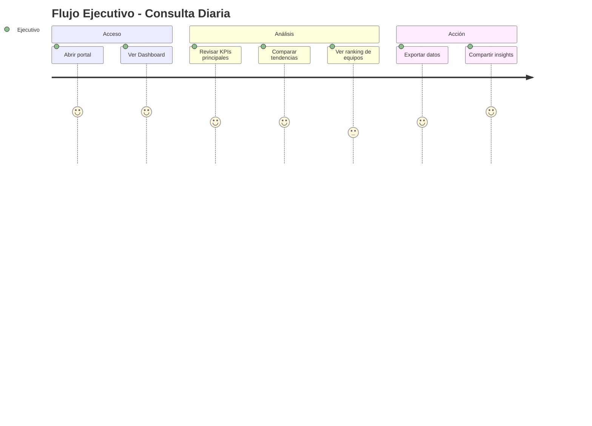
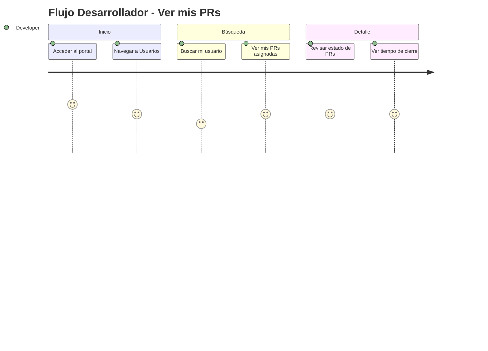

# Copilot Metrics Portal - Documentación Funcional

## Descripción General

El Copilot Metrics Portal es un dashboard ejecutivo diseñado para BBVA que permite visualizar y analizar las métricas de adopción de GitHub Copilot en la organización. Proporciona insights sobre productividad, uso de agentes personalizados, y efectividad de los Pull Requests generados por IA.

## Objetivos del Sistema

- **Visibilidad Ejecutiva**: Proporcionar métricas clave de adopción de Copilot a nivel organizacional
- **Análisis de Productividad**: Medir el impacto de Copilot en la generación de código y PRs
- **Tracking de Agentes**: Monitorear el uso y efectividad de Custom Agents de Copilot
- **Rankings y Gamificación**: Mostrar contribuidores destacados para fomentar adopción
- **Tiempo Real**: Ofrecer datos actualizados mediante WebSocket

## Usuarios y Roles

| Rol | Descripción | Permisos |
|-----|-------------|----------|
| Ejecutivo | Directivos y managers que monitorean adopción | Solo lectura de métricas agregadas |
| Developer Lead | Líderes técnicos que analizan equipos | Lectura de métricas + rankings detallados |
| Desarrollador | Usuarios individuales de Copilot | Ver su posición en rankings y PRs propias |

## Mapa de Funcionalidades

## Índice de Funcionalidades

| ID | Funcionalidad | Módulo | Estado | Documentación |
|----|---------------|--------|--------|---------------|
| F001 | Dashboard Ejecutivo | Principal | Activo | [feat-executive-dashboard.md](features/feat-executive-dashboard.md) |
| F002 | Overview con Métricas | Principal | Activo | [feat-overview.md](features/feat-overview.md) |
| F003 | Gestión de Usuarios | Usuarios | Activo | [feat-users.md](features/feat-users.md) |
| F004 | Análisis de PRs | PRs | Activo | [feat-pull-requests.md](features/feat-pull-requests.md) |
| F005 | Analytics de Agentes | Agentes | Activo | [feat-agents.md](features/feat-agents.md) |
| F006 | Configuración | Settings | Activo | [feat-settings.md](features/feat-settings.md) |
| F007 | Tiempo Real (WebSocket) | Infraestructura | Activo | [feat-realtime.md](features/feat-realtime.md) |
| F008 | PWA Offline | Infraestructura | Activo | [feat-pwa.md](features/feat-pwa.md) |

## Navegación Principal

## Métricas Principales (KPIs)

### Adopción
| Métrica | Descripción | Cálculo |
|---------|-------------|---------|
| Total Licencias | Seats de Copilot asignados | Directo de API |
| Con Actividad | Usuarios que han usado Copilot | Filtro por `lastActivityAt != null` |
| Tasa de Adopción | % de licencias activas | `(conActividad / totalLicencias) * 100` |
| Activos 7 días | Usuarios activos última semana | Filtro por fecha |

### Pull Requests
| Métrica | Descripción | Cálculo |
|---------|-------------|---------|
| Total PRs | PRs creadas por Copilot SWE Agent | Búsqueda por autor `app/copilot-swe-agent` |
| Merge Rate | % de PRs integradas | `(merged / closed) * 100` |
| Rejection Rate | % de PRs cerradas sin merge | `(rejected / closed) * 100` |
| Avg Days to Close | Tiempo promedio de cierre | Promedio de `daysToClose` |

### Agentes
| Métrica | Descripción | Cálculo |
|---------|-------------|---------|
| Unique Agents | Agentes distintos usados | Count de Custom Agents únicos |
| With Agent | PRs con agente personalizado | Filtro por `customAgent != '-'` |
| Agent Effectiveness | Merge rate por agente | Por cada agente: `merged / total` |

## Flujos de Usuario Principales

### Flujo: Consulta de Métricas Ejecutivas

### Flujo: Análisis de PRs por Desarrollador

## Reglas de Negocio

| ID | Regla | Descripción |
|----|-------|-------------|
| RN001 | Cálculo de Actividad | Un usuario se considera "activo" si tiene `lastActivityAt` no nulo |
| RN002 | Merge Rate | Solo se calcula sobre PRs cerradas (excluye abiertas) |
| RN003 | Custom Agent | Se extrae del body del PR buscando "Custom agent used:" |
| RN004 | Rate Limiting | Máximo 1 refresh manual cada 10 segundos |
| RN005 | Caché TTL | Datos se mantienen en caché 30 segundos por defecto |

## Mensajes del Sistema

| Código | Tipo | Mensaje |
|--------|------|---------|
| MSG001 | Info | "Datos actualizados correctamente" |
| MSG002 | Warning | "Trabajando en modo offline" |
| MSG003 | Error | "Error al conectar con GitHub" |
| MSG004 | Rate Limit | "Por favor espera X segundos antes de actualizar" |

## Referencias

- [Documentación de Arquitectura](../architecture/overview.md)
- [API de GitHub Copilot](https://docs.github.com/en/rest/copilot)
- [GitHub Enterprise BBVA](https://bbva.ghe.com)
